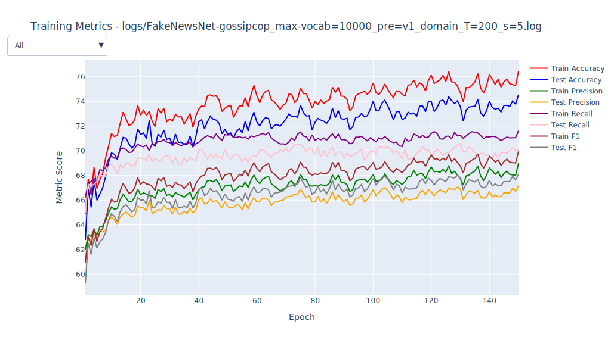
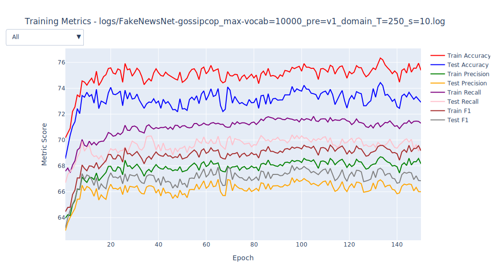
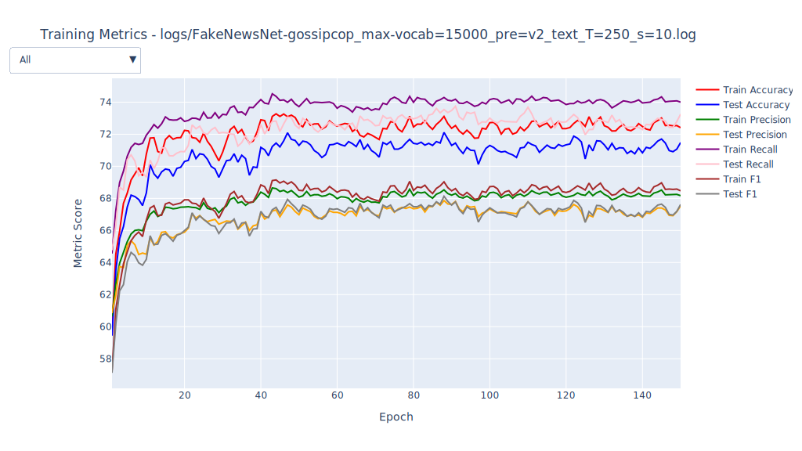
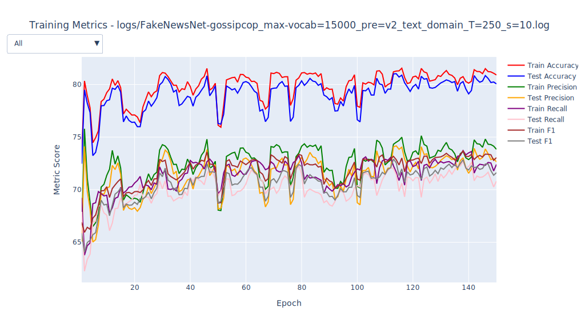
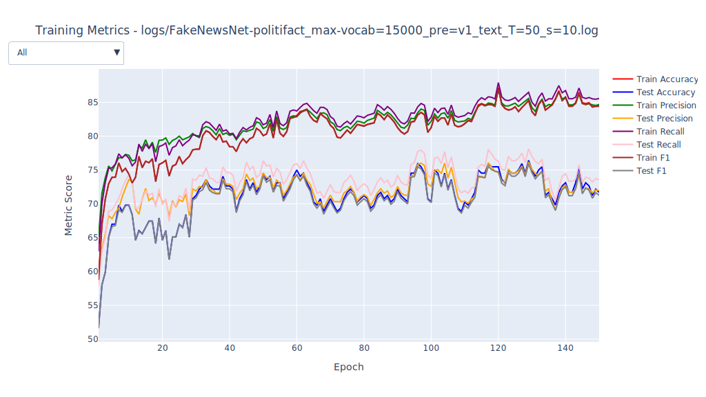
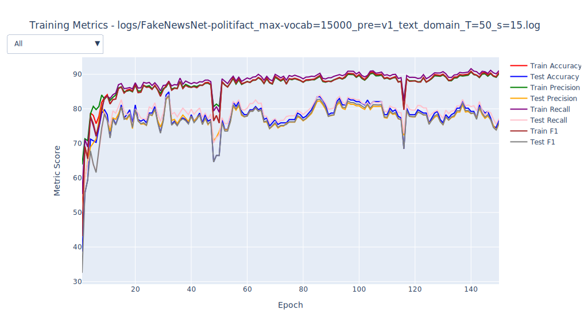
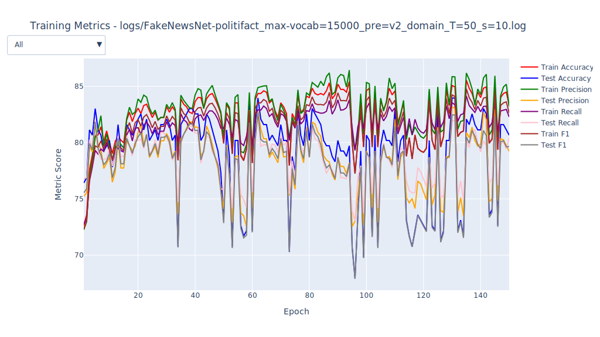
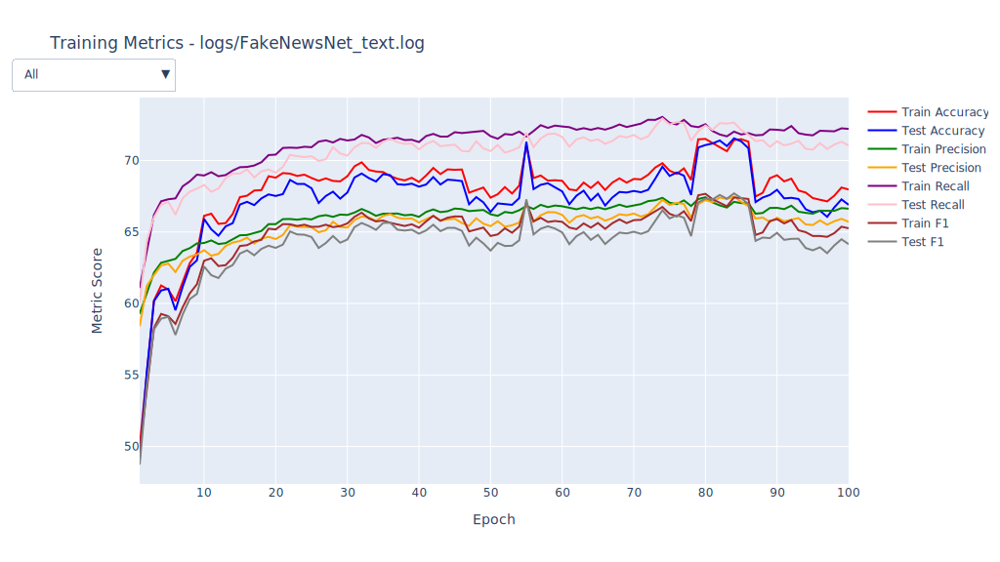
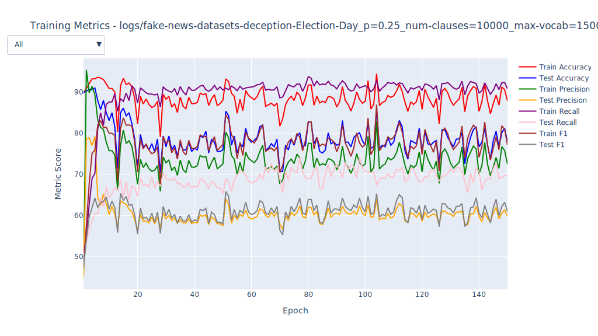

# Plots
## FakeCovid_domain.svg

| Metric | Epoch 1 | Epoch 100 | &#8710;% last | Max | &#8710;% max | Std Dev |
| - | - | - | - | - | - | - |
| Train Accuracy | 33.06 | 35.39 | 07.05 | 51.44 | 55.60 | 03.59 |
| Test Accuracy | 35.43 | 33.04 | -6.75 | 48.43 | 36.69 | 03.19 |
| Train Precision | 19.93 | 20.03 | 00.50 | 27.64 | 38.69 | 01.78 |
| Test Precision | 17.75 | 17.75 | 00.00 | 28.08 | 58.20 | 02.32 |
| Train Recall | 19.30 | 41.32 | 114.09 | 51.11 | 164.82 | 05.84 |
| Test Recall | 17.70 | 32.31 | 82.54 | 42.53 | 140.28 | 04.93 |
| Train F1 | 17.14 | 20.15 | 17.56 | 29.09 | 69.72 | 02.40 |
| Test F1 | 15.22 | 17.50 | 14.98 | 25.40 | 66.89 | 02.10 |
## FakeCovid_text.svg

| Metric | Epoch 1 | Epoch 100 | &#8710;% last | Max | &#8710;% max | Std Dev |
| - | - | - | - | - | - | - |
| Train Accuracy | 20.16 | 45.89 | 127.63 | 51.01 | 153.03 | 04.79 |
| Test Accuracy | 18.81 | 42.95 | 128.34 | 50.14 | 166.56 | 04.61 |
| Train Precision | 35.80 | 25.09 | -29.92 | 45.95 | 28.35 | 06.78 |
| Test Precision | 10.02 | 21.14 | 110.98 | 37.62 | 275.45 | 05.47 |
| Train Recall | 14.06 | 38.34 | 172.69 | 47.92 | 240.83 | 09.32 |
| Test Recall | 11.12 | 29.94 | 169.24 | 36.60 | 229.14 | 06.29 |
| Train F1 | 08.88 | 27.48 | 209.46 | 31.07 | 249.89 | 04.96 |
| Test F1 | 06.16 | 22.24 | 261.04 | 26.03 | 322.56 | 03.92 |
## FakeCovid_text_domain.svg

| Metric | Epoch 1 | Epoch 100 | &#8710;% last | Max | &#8710;% max | Std Dev |
| - | - | - | - | - | - | - |
| Train Accuracy | 42.04 | 40.71 | -3.16 | 53.73 | 27.81 | 03.86 |
| Test Accuracy | 42.00 | 38.44 | -8.48 | 50.96 | 21.33 | 04.00 |
| Train Precision | 41.87 | 31.00 | -25.96 | 47.48 | 13.40 | 04.90 |
| Test Precision | 10.22 | 28.68 | 180.63 | 30.94 | 202.74 | 03.52 |
| Train Recall | 11.28 | 48.71 | 331.83 | 51.45 | 356.12 | 09.65 |
| Test Recall | 10.41 | 34.12 | 227.76 | 41.79 | 301.44 | 07.01 |
| Train F1 | 09.33 | 30.11 | 222.72 | 31.60 | 238.69 | 04.12 |
| Test F1 | 07.52 | 22.00 | 192.55 | 25.36 | 237.23 | 03.45 |
## FakeNewsNet-gossipcop_domain.svg

| Metric | Epoch 1 | Epoch 100 | &#8710;% last | Max | &#8710;% max | Std Dev |
| - | - | - | - | - | - | - |
| Train Accuracy | 64.91 | 74.98 | 15.51 | 74.98 | 15.51 | 01.54 |
| Test Accuracy | 63.84 | 73.24 | 14.72 | 73.24 | 14.72 | 01.43 |
| Train Precision | 61.97 | 68.09 | 09.88 | 68.09 | 09.88 | 01.07 |
| Test Precision | 61.62 | 66.55 | 08.00 | 66.69 | 08.23 | 00.86 |
| Train Recall | 66.16 | 71.71 | 08.39 | 71.81 | 08.54 | 01.05 |
| Test Recall | 65.76 | 70.22 | 06.78 | 70.89 | 07.80 | 00.83 |
| Train F1 | 60.92 | 69.13 | 13.48 | 69.13 | 13.48 | 01.34 |
| Test F1 | 60.17 | 67.44 | 12.08 | 67.56 | 12.28 | 01.17 |
## FakeNewsNet-gossipcop_domain_tweet.svg

| Metric | Epoch 1 | Epoch 100 | &#8710;% last | Max | &#8710;% max | Std Dev |
| - | - | - | - | - | - | - |
| Train Accuracy | 62.66 | 75.09 | 19.84 | 76.86 | 22.66 | 01.70 |
| Test Accuracy | 61.99 | 73.24 | 18.15 | 74.91 | 20.84 | 01.59 |
| Train Precision | 61.02 | 67.87 | 11.23 | 69.07 | 13.19 | 01.21 |
| Test Precision | 61.23 | 66.20 | 08.12 | 67.23 | 09.80 | 01.00 |
| Train Recall | 65.02 | 71.05 | 09.27 | 71.44 | 09.87 | 01.07 |
| Test Recall | 65.34 | 69.48 | 06.34 | 70.18 | 07.41 | 00.91 |
| Train F1 | 59.17 | 68.88 | 16.41 | 69.82 | 18.00 | 01.43 |
| Test F1 | 58.91 | 67.08 | 13.87 | 68.13 | 15.65 | 01.27 |
## FakeNewsNet-gossipcop_max-vocab=10000_pre=v1_domain_T=150_s=10.svg

| Metric | Epoch 1 | Epoch 150 | &#8710;% last | Max | &#8710;% max | Std Dev |
| - | - | - | - | - | - | - |
| Train Accuracy | 67.72 | 74.45 | 09.94 | 75.42 | 11.37 | 01.02 |
| Test Accuracy | 66.73 | 72.61 | 08.81 | 74.12 | 11.07 | 00.94 |
| Train Precision | 62.77 | 67.58 | 07.66 | 68.23 | 08.70 | 00.78 |
| Test Precision | 62.28 | 66.13 | 06.18 | 67.04 | 07.64 | 00.65 |
| Train Recall | 66.70 | 71.22 | 06.78 | 71.57 | 07.30 | 00.70 |
| Test Recall | 66.19 | 69.93 | 05.65 | 70.44 | 06.42 | 00.61 |
| Train F1 | 62.72 | 68.58 | 09.34 | 69.27 | 10.44 | 00.89 |
| Test F1 | 61.99 | 66.94 | 07.99 | 67.99 | 09.68 | 00.78 |
## FakeNewsNet-gossipcop_max-vocab=10000_pre=v1_domain_T=150_s=15.svg

| Metric | Epoch 1 | Epoch 150 | &#8710;% last | Max | &#8710;% max | Std Dev |
| - | - | - | - | - | - | - |
| Train Accuracy | 66.62 | 74.92 | 12.46 | 80.58 | 20.95 | 01.29 |
| Test Accuracy | 64.97 | 72.90 | 12.21 | 80.17 | 23.40 | 01.51 |
| Train Precision | 62.40 | 67.83 | 08.70 | 73.88 | 18.40 | 01.10 |
| Test Precision | 61.64 | 66.20 | 07.40 | 73.14 | 18.66 | 01.19 |
| Train Recall | 66.45 | 71.19 | 07.13 | 71.89 | 08.19 | 00.98 |
| Test Recall | 65.60 | 69.80 | 06.40 | 70.71 | 07.79 | 00.74 |
| Train F1 | 62.00 | 68.84 | 11.03 | 70.02 | 12.94 | 00.78 |
| Test F1 | 60.76 | 67.05 | 10.35 | 69.71 | 14.73 | 00.79 |
## FakeNewsNet-gossipcop_max-vocab=10000_pre=v1_domain_T=150_s=5.svg

| Metric | Epoch 1 | Epoch 150 | &#8710;% last | Max | &#8710;% max | Std Dev |
| - | - | - | - | - | - | - |
| Train Accuracy | 64.19 | 74.87 | 16.64 | 75.41 | 17.48 | 01.68 |
| Test Accuracy | 63.80 | 72.49 | 13.62 | 73.94 | 15.89 | 01.57 |
| Train Precision | 61.36 | 67.86 | 10.59 | 68.17 | 11.10 | 01.03 |
| Test Precision | 61.77 | 65.82 | 06.56 | 67.25 | 08.87 | 00.88 |
| Train Recall | 65.36 | 71.33 | 09.13 | 71.57 | 09.50 | 00.88 |
| Test Recall | 65.98 | 69.41 | 05.20 | 71.00 | 07.61 | 00.82 |
| Train F1 | 60.19 | 68.88 | 14.44 | 69.20 | 14.97 | 01.34 |
| Test F1 | 60.23 | 66.63 | 10.63 | 68.21 | 13.25 | 01.23 |
## FakeNewsNet-gossipcop_max-vocab=10000_pre=v1_domain_T=200_s=10.svg

| Metric | Epoch 1 | Epoch 150 | &#8710;% last | Max | &#8710;% max | Std Dev |
| - | - | - | - | - | - | - |
| Train Accuracy | 68.37 | 75.12 | 09.87 | 75.71 | 10.74 | 00.77 |
| Test Accuracy | 68.41 | 73.60 | 07.59 | 74.14 | 08.38 | 00.69 |
| Train Precision | 62.80 | 67.95 | 08.20 | 68.38 | 08.89 | 00.65 |
| Test Precision | 62.91 | 66.67 | 05.98 | 67.06 | 06.60 | 00.54 |
| Train Recall | 66.48 | 71.19 | 07.08 | 71.74 | 07.91 | 00.65 |
| Test Recall | 66.62 | 70.10 | 05.22 | 70.65 | 06.05 | 00.58 |
| Train F1 | 62.98 | 68.97 | 09.51 | 69.42 | 10.23 | 00.72 |
| Test F1 | 63.09 | 67.59 | 07.13 | 68.00 | 07.78 | 00.62 |
## FakeNewsNet-gossipcop_max-vocab=10000_pre=v1_domain_T=200_s=15.svg

| Metric | Epoch 1 | Epoch 150 | &#8710;% last | Max | &#8710;% max | Std Dev |
| - | - | - | - | - | - | - |
| Train Accuracy | 69.64 | 75.84 | 08.90 | 82.28 | 18.15 | 01.57 |
| Test Accuracy | 68.97 | 73.98 | 07.26 | 82.02 | 18.92 | 01.98 |
| Train Precision | 63.14 | 68.48 | 08.46 | 80.84 | 28.03 | 02.44 |
| Test Precision | 63.00 | 66.68 | 05.84 | 81.15 | 28.81 | 02.70 |
| Train Recall | 66.43 | 71.41 | 07.50 | 71.82 | 08.11 | 01.32 |
| Test Recall | 66.51 | 69.68 | 04.77 | 70.52 | 06.03 | 00.91 |
| Train F1 | 63.62 | 69.49 | 09.23 | 70.90 | 11.44 | 00.62 |
| Test F1 | 63.33 | 67.60 | 06.74 | 70.87 | 11.91 | 00.67 |
## FakeNewsNet-gossipcop_max-vocab=10000_pre=v1_domain_T=200_s=5.svg

| Metric | Epoch 1 | Epoch 150 | &#8710;% last | Max | &#8710;% max | Std Dev |
| - | - | - | - | - | - | - |
| Train Accuracy | 64.85 | 76.44 | 17.87 | 76.44 | 17.87 | 01.93 |
| Test Accuracy | 62.78 | 74.55 | 18.75 | 74.55 | 18.75 | 01.82 |
| Train Precision | 62.01 | 68.99 | 11.26 | 68.99 | 11.26 | 01.18 |
| Test Precision | 61.00 | 67.18 | 10.13 | 67.18 | 10.13 | 00.96 |
| Train Recall | 66.23 | 71.63 | 08.15 | 71.63 | 08.15 | 00.84 |
| Test Recall | 64.96 | 70.09 | 07.90 | 70.60 | 08.68 | 00.73 |
| Train F1 | 60.91 | 69.95 | 14.84 | 69.95 | 14.84 | 01.47 |
| Test F1 | 59.25 | 68.11 | 14.95 | 68.11 | 14.95 | 01.33 |
## FakeNewsNet-gossipcop_max-vocab=10000_pre=v1_domain_T=250_s=10.svg

| Metric | Epoch 1 | Epoch 150 | &#8710;% last | Max | &#8710;% max | Std Dev |
| - | - | - | - | - | - | - |
| Train Accuracy | 70.17 | 75.39 | 07.44 | 76.34 | 08.79 | 00.85 |
| Test Accuracy | 68.56 | 72.92 | 06.36 | 74.44 | 08.58 | 00.76 |
| Train Precision | 63.96 | 68.16 | 06.57 | 68.70 | 07.41 | 00.76 |
| Test Precision | 62.99 | 66.00 | 04.78 | 67.09 | 06.51 | 00.57 |
| Train Recall | 67.59 | 71.30 | 05.49 | 71.83 | 06.27 | 00.79 |
| Test Recall | 66.69 | 69.37 | 04.02 | 70.40 | 05.56 | 00.58 |
| Train F1 | 64.46 | 69.17 | 07.31 | 69.61 | 07.99 | 00.82 |
| Test F1 | 63.20 | 66.85 | 05.78 | 68.04 | 07.66 | 00.65 |
## FakeNewsNet-gossipcop_max-vocab=10000_pre=v1_domain_T=250_s=15.svg

| Metric | Epoch 1 | Epoch 150 | &#8710;% last | Max | &#8710;% max | Std Dev |
| - | - | - | - | - | - | - |
| Train Accuracy | 70.36 | 74.92 | 06.48 | 81.13 | 15.31 | 00.91 |
| Test Accuracy | 69.78 | 72.79 | 04.31 | 81.12 | 16.25 | 01.17 |
| Train Precision | 63.70 | 67.88 | 06.56 | 75.27 | 18.16 | 00.97 |
| Test Precision | 63.73 | 66.22 | 03.91 | 75.44 | 18.37 | 01.22 |
| Train Recall | 67.01 | 71.31 | 06.42 | 71.93 | 07.34 | 00.90 |
| Test Recall | 67.37 | 69.95 | 03.83 | 70.76 | 05.03 | 00.57 |
| Train F1 | 64.28 | 68.90 | 07.19 | 70.33 | 09.41 | 00.60 |
| Test F1 | 64.17 | 67.05 | 04.49 | 70.28 | 09.52 | 00.57 |
## FakeNewsNet-gossipcop_max-vocab=10000_pre=v1_domain_T=250_s=5.svg

| Metric | Epoch 1 | Epoch 150 | &#8710;% last | Max | &#8710;% max | Std Dev |
| - | - | - | - | - | - | - |
| Train Accuracy | 69.33 | 75.73 | 09.23 | 76.72 | 10.66 | 01.75 |
| Test Accuracy | 68.20 | 74.48 | 09.21 | 75.00 | 09.97 | 01.62 |
| Train Precision | 63.18 | 68.20 | 07.95 | 68.94 | 09.12 | 01.19 |
| Test Precision | 62.57 | 67.08 | 07.21 | 67.50 | 07.88 | 00.98 |
| Train Recall | 66.69 | 70.84 | 06.22 | 71.39 | 07.05 | 00.85 |
| Test Recall | 66.13 | 69.95 | 05.78 | 70.71 | 06.93 | 00.77 |
| Train F1 | 63.58 | 69.14 | 08.74 | 69.77 | 09.74 | 01.34 |
| Test F1 | 62.75 | 68.01 | 08.38 | 68.42 | 09.04 | 01.19 |
## FakeNewsNet-gossipcop_max-vocab=10000_pre=v1_domain_T=50_s=10.svg

| Metric | Epoch 1 | Epoch 150 | &#8710;% last | Max | &#8710;% max | Std Dev |
| - | - | - | - | - | - | - |
| Train Accuracy | 62.10 | 74.63 | 20.18 | 75.02 | 20.81 | 01.96 |
| Test Accuracy | 61.18 | 72.88 | 19.12 | 73.33 | 19.86 | 01.77 |
| Train Precision | 61.38 | 67.86 | 10.56 | 68.11 | 10.96 | 01.19 |
| Test Precision | 60.99 | 66.54 | 09.10 | 66.82 | 09.56 | 00.93 |
| Train Recall | 65.57 | 71.63 | 09.24 | 71.95 | 09.73 | 01.11 |
| Test Recall | 65.02 | 70.52 | 08.46 | 70.89 | 09.03 | 00.89 |
| Train F1 | 59.03 | 68.88 | 16.69 | 69.15 | 17.14 | 01.60 |
| Test F1 | 58.30 | 67.37 | 15.56 | 67.71 | 16.14 | 01.38 |
## FakeNewsNet-gossipcop_max-vocab=10000_pre=v1_domain_T=50_s=15.svg

| Metric | Epoch 1 | Epoch 150 | &#8710;% last | Max | &#8710;% max | Std Dev |
| - | - | - | - | - | - | - |
| Train Accuracy | 60.99 | 74.16 | 21.59 | 75.21 | 23.32 | 01.86 |
| Test Accuracy | 61.50 | 72.06 | 17.17 | 73.46 | 19.45 | 01.61 |
| Train Precision | 61.12 | 67.81 | 10.95 | 68.41 | 11.93 | 01.11 |
| Test Precision | 61.59 | 66.15 | 07.40 | 66.94 | 08.69 | 00.85 |
| Train Recall | 65.23 | 72.04 | 10.44 | 72.31 | 10.85 | 01.02 |
| Test Recall | 65.84 | 70.40 | 06.93 | 71.05 | 07.91 | 00.79 |
| Train F1 | 58.23 | 68.78 | 18.12 | 69.48 | 19.32 | 01.52 |
| Test F1 | 58.77 | 66.84 | 13.73 | 67.85 | 15.45 | 01.26 |
## FakeNewsNet-gossipcop_max-vocab=10000_pre=v1_domain_T=50_s=5.svg

| Metric | Epoch 1 | Epoch 150 | &#8710;% last | Max | &#8710;% max | Std Dev |
| - | - | - | - | - | - | - |
| Train Accuracy | 63.97 | 71.92 | 12.43 | 74.27 | 16.10 | 01.66 |
| Test Accuracy | 63.14 | 70.17 | 11.13 | 72.49 | 14.81 | 01.60 |
| Train Precision | 61.72 | 66.21 | 07.27 | 67.46 | 09.30 | 00.89 |
| Test Precision | 61.56 | 64.89 | 05.41 | 66.16 | 07.47 | 00.78 |
| Train Recall | 65.92 | 70.65 | 07.18 | 71.17 | 07.96 | 00.82 |
| Test Recall | 65.74 | 69.22 | 05.29 | 70.31 | 06.95 | 00.79 |
| Train F1 | 60.28 | 66.84 | 10.88 | 68.45 | 13.55 | 01.28 |
| Test F1 | 59.75 | 65.23 | 09.17 | 66.95 | 12.05 | 01.21 |
## FakeNewsNet-gossipcop_max-vocab=15000_pre=v2_domain_T=150_s=10.svg

| Metric | Epoch 1 | Epoch 150 | &#8710;% last | Max | &#8710;% max | Std Dev |
| - | - | - | - | - | - | - |
| Train Accuracy | 81.83 | 82.75 | 01.12 | 83.45 | 01.98 | 00.86 |
| Test Accuracy | 81.80 | 82.25 | 00.55 | 83.49 | 02.07 | 00.96 |
| Train Precision | 80.58 | 79.18 | -1.74 | 82.65 | 02.57 | 02.41 |
| Test Precision | 80.26 | 78.09 | -2.70 | 82.55 | 02.85 | 02.54 |
| Train Recall | 65.19 | 69.22 | 06.18 | 69.87 | 07.18 | 00.64 |
| Test Recall | 65.43 | 68.76 | 05.09 | 69.60 | 06.37 | 00.61 |
| Train F1 | 67.89 | 71.98 | 06.02 | 72.50 | 06.79 | 00.75 |
| Test F1 | 68.13 | 71.36 | 04.74 | 72.40 | 06.27 | 00.79 |
## FakeNewsNet-gossipcop_max-vocab=15000_pre=v2_domain_T=150_s=15.svg

| Metric | Epoch 1 | Epoch 150 | &#8710;% last | Max | &#8710;% max | Std Dev |
| - | - | - | - | - | - | - |
| Train Accuracy | 81.80 | 83.21 | 01.72 | 83.44 | 02.00 | 00.36 |
| Test Accuracy | 82.00 | 83.06 | 01.29 | 83.54 | 01.88 | 00.43 |
| Train Precision | 80.40 | 82.96 | 03.18 | 84.59 | 05.21 | 01.55 |
| Test Precision | 81.11 | 82.44 | 01.64 | 84.78 | 04.52 | 01.75 |
| Train Recall | 65.23 | 67.80 | 03.94 | 69.51 | 06.56 | 00.62 |
| Test Recall | 65.53 | 67.80 | 03.46 | 69.21 | 05.62 | 00.55 |
| Train F1 | 67.92 | 71.00 | 04.53 | 71.92 | 05.89 | 00.60 |
| Test F1 | 68.30 | 70.94 | 03.87 | 72.11 | 05.58 | 00.55 |
## FakeNewsNet-gossipcop_max-vocab=15000_pre=v2_domain_T=150_s=5.svg

| Metric | Epoch 1 | Epoch 150 | &#8710;% last | Max | &#8710;% max | Std Dev |
| - | - | - | - | - | - | - |
| Train Accuracy | 79.49 | 82.28 | 03.51 | 83.62 | 05.20 | 02.81 |
| Test Accuracy | 79.31 | 81.57 | 02.85 | 83.36 | 05.11 | 02.85 |
| Train Precision | 72.14 | 76.67 | 06.28 | 82.56 | 14.44 | 04.04 |
| Test Precision | 71.80 | 75.49 | 05.14 | 82.20 | 14.48 | 03.99 |
| Train Recall | 65.66 | 71.09 | 08.27 | 71.71 | 09.21 | 01.04 |
| Test Recall | 65.81 | 70.21 | 06.69 | 70.39 | 06.96 | 00.89 |
| Train F1 | 67.51 | 73.08 | 08.25 | 73.46 | 08.81 | 01.86 |
| Test F1 | 67.58 | 72.08 | 06.66 | 72.48 | 07.25 | 01.82 |
## FakeNewsNet-gossipcop_max-vocab=15000_pre=v2_domain_T=200_s=10.svg

| Metric | Epoch 1 | Epoch 150 | &#8710;% last | Max | &#8710;% max | Std Dev |
| - | - | - | - | - | - | - |
| Train Accuracy | 81.43 | 83.06 | 02.00 | 83.68 | 02.76 | 00.66 |
| Test Accuracy | 81.37 | 82.72 | 01.66 | 83.54 | 02.67 | 00.72 |
| Train Precision | 77.60 | 79.91 | 02.98 | 84.05 | 08.31 | 02.21 |
| Test Precision | 77.48 | 78.87 | 01.79 | 83.83 | 08.20 | 02.32 |
| Train Recall | 66.09 | 69.58 | 05.28 | 70.27 | 06.32 | 01.01 |
| Test Recall | 66.14 | 69.62 | 05.26 | 69.87 | 05.64 | 00.89 |
| Train F1 | 68.64 | 72.43 | 05.52 | 72.95 | 06.28 | 01.03 |
| Test F1 | 68.67 | 72.29 | 05.27 | 72.66 | 05.81 | 00.95 |
## FakeNewsNet-gossipcop_max-vocab=15000_pre=v2_domain_T=200_s=15.svg

| Metric | Epoch 1 | Epoch 150 | &#8710;% last | Max | &#8710;% max | Std Dev |
| - | - | - | - | - | - | - |
| Train Accuracy | 82.07 | 83.16 | 01.33 | 83.56 | 01.82 | 00.21 |
| Test Accuracy | 82.59 | 82.84 | 00.30 | 83.56 | 01.17 | 00.23 |
| Train Precision | 80.13 | 82.08 | 02.43 | 85.35 | 06.51 | 00.99 |
| Test Precision | 81.54 | 81.09 | -0.55 | 85.44 | 04.78 | 01.14 |
| Train Recall | 66.20 | 68.20 | 03.02 | 69.19 | 04.52 | 00.62 |
| Test Recall | 66.97 | 68.00 | 01.54 | 69.24 | 03.39 | 00.56 |
| Train F1 | 68.99 | 71.33 | 03.39 | 72.26 | 04.74 | 00.62 |
| Test F1 | 69.96 | 71.01 | 01.50 | 72.33 | 03.39 | 00.56 |
## FakeNewsNet-gossipcop_max-vocab=15000_pre=v2_domain_T=200_s=5.svg

| Metric | Epoch 1 | Epoch 150 | &#8710;% last | Max | &#8710;% max | Std Dev |
| - | - | - | - | - | - | - |
| Train Accuracy | 80.34 | 81.18 | 01.05 | 83.63 | 04.10 | 02.24 |
| Test Accuracy | 80.26 | 80.47 | 00.26 | 83.45 | 03.97 | 02.28 |
| Train Precision | 74.12 | 74.64 | 00.70 | 82.46 | 11.25 | 03.82 |
| Test Precision | 73.95 | 73.44 | -0.69 | 82.15 | 11.09 | 03.80 |
| Train Recall | 66.06 | 70.04 | 06.02 | 71.43 | 08.13 | 00.93 |
| Test Recall | 66.21 | 69.41 | 04.83 | 70.97 | 07.19 | 00.78 |
| Train F1 | 68.19 | 71.73 | 05.19 | 73.57 | 07.89 | 01.51 |
| Test F1 | 68.30 | 70.92 | 03.84 | 72.89 | 06.72 | 01.46 |
## FakeNewsNet-gossipcop_max-vocab=15000_pre=v2_domain_T=250_s=10.svg

| Metric | Epoch 1 | Epoch 150 | &#8710;% last | Max | &#8710;% max | Std Dev |
| - | - | - | - | - | - | - |
| Train Accuracy | 82.53 | 83.58 | 01.27 | 83.85 | 01.60 | 00.64 |
| Test Accuracy | 82.66 | 83.33 | 00.81 | 83.60 | 01.14 | 00.71 |
| Train Precision | 83.39 | 82.91 | -0.58 | 83.98 | 00.71 | 01.97 |
| Test Precision | 83.63 | 82.22 | -1.69 | 84.09 | 00.55 | 02.18 |
| Train Recall | 65.76 | 68.86 | 04.71 | 70.72 | 07.54 | 00.73 |
| Test Recall | 66.09 | 68.71 | 03.96 | 69.79 | 05.60 | 00.56 |
| Train F1 | 68.72 | 72.12 | 04.95 | 73.12 | 06.40 | 00.77 |
| Test F1 | 69.11 | 71.88 | 04.01 | 72.74 | 05.25 | 00.64 |
## FakeNewsNet-gossipcop_max-vocab=15000_pre=v2_domain_T=250_s=15.svg

| Metric | Epoch 1 | Epoch 150 | &#8710;% last | Max | &#8710;% max | Std Dev |
| - | - | - | - | - | - | - |
| Train Accuracy | 82.21 | 83.43 | 01.48 | 83.70 | 01.81 | 00.29 |
| Test Accuracy | 82.48 | 83.33 | 01.03 | 83.79 | 01.59 | 00.36 |
| Train Precision | 84.21 | 83.56 | -0.77 | 84.55 | 00.40 | 01.12 |
| Test Precision | 85.06 | 83.12 | -2.28 | 85.06 | 00.00 | 01.38 |
| Train Recall | 64.60 | 68.09 | 05.40 | 69.61 | 07.76 | 00.68 |
| Test Recall | 65.08 | 68.17 | 04.75 | 69.52 | 06.82 | 00.65 |
| Train F1 | 67.36 | 71.38 | 05.97 | 72.62 | 07.81 | 00.71 |
| Test F1 | 67.97 | 71.40 | 05.05 | 72.61 | 06.83 | 00.68 |
## FakeNewsNet-gossipcop_max-vocab=15000_pre=v2_domain_T=250_s=5.svg

| Metric | Epoch 1 | Epoch 150 | &#8710;% last | Max | &#8710;% max | Std Dev |
| - | - | - | - | - | - | - |
| Train Accuracy | 81.71 | 83.44 | 02.12 | 83.90 | 02.68 | 02.56 |
| Test Accuracy | 81.89 | 83.65 | 02.15 | 83.88 | 02.43 | 02.71 |
| Train Precision | 79.01 | 81.22 | 02.80 | 83.96 | 06.27 | 04.30 |
| Test Precision | 79.38 | 81.98 | 03.28 | 84.78 | 06.80 | 04.41 |
| Train Recall | 65.85 | 69.65 | 05.77 | 71.63 | 08.78 | 01.01 |
| Test Recall | 66.29 | 69.82 | 05.33 | 70.82 | 06.83 | 00.85 |
| Train F1 | 68.51 | 72.70 | 06.12 | 73.70 | 07.58 | 01.64 |
| Test F1 | 69.02 | 72.96 | 05.71 | 72.96 | 05.71 | 01.70 |
## FakeNewsNet-gossipcop_max-vocab=15000_pre=v2_domain_T=50_s=10.svg

| Metric | Epoch 1 | Epoch 150 | &#8710;% last | Max | &#8710;% max | Std Dev |
| - | - | - | - | - | - | - |
| Train Accuracy | 77.29 | 81.13 | 04.97 | 81.89 | 05.95 | 01.52 |
| Test Accuracy | 76.67 | 80.67 | 05.22 | 81.96 | 06.90 | 01.62 |
| Train Precision | 68.28 | 74.97 | 09.80 | 76.95 | 12.70 | 02.33 |
| Test Precision | 67.45 | 74.15 | 09.93 | 76.90 | 14.01 | 02.41 |
| Train Recall | 65.99 | 68.63 | 04.00 | 70.35 | 06.61 | 00.70 |
| Test Recall | 65.47 | 68.24 | 04.23 | 70.14 | 07.13 | 00.79 |
| Train F1 | 66.90 | 70.67 | 05.64 | 71.69 | 07.16 | 00.99 |
| Test F1 | 66.27 | 70.16 | 05.87 | 71.56 | 07.98 | 01.11 |
## FakeNewsNet-gossipcop_max-vocab=15000_pre=v2_domain_T=50_s=15.svg

| Metric | Epoch 1 | Epoch 150 | &#8710;% last | Max | &#8710;% max | Std Dev |
| - | - | - | - | - | - | - |
| Train Accuracy | 80.37 | 79.54 | -1.03 | 82.25 | 02.34 | 01.04 |
| Test Accuracy | 80.15 | 79.27 | -1.10 | 82.57 | 03.02 | 01.17 |
| Train Precision | 74.44 | 71.86 | -3.47 | 78.85 | 05.92 | 02.11 |
| Test Precision | 73.99 | 71.46 | -3.42 | 79.15 | 06.97 | 02.32 |
| Train Recall | 65.61 | 68.02 | 03.67 | 69.82 | 06.42 | 00.64 |
| Test Recall | 65.49 | 67.82 | 03.56 | 69.37 | 05.92 | 00.68 |
| Train F1 | 67.79 | 69.43 | 02.42 | 70.87 | 04.54 | 00.57 |
| Test F1 | 67.61 | 69.17 | 02.31 | 71.51 | 05.77 | 00.71 |
## FakeNewsNet-gossipcop_max-vocab=15000_pre=v2_domain_T=50_s=5.svg

| Metric | Epoch 1 | Epoch 150 | &#8710;% last | Max | &#8710;% max | Std Dev |
| - | - | - | - | - | - | - |
| Train Accuracy | 72.65 | 81.55 | 12.25 | 81.89 | 12.72 | 02.13 |
| Test Accuracy | 72.54 | 80.60 | 11.11 | 81.59 | 12.48 | 02.31 |
| Train Precision | 64.58 | 75.33 | 16.65 | 76.30 | 18.15 | 02.60 |
| Test Precision | 64.66 | 73.71 | 14.00 | 75.71 | 17.09 | 02.63 |
| Train Recall | 66.76 | 70.33 | 05.35 | 71.07 | 06.46 | 00.74 |
| Test Recall | 66.97 | 69.37 | 03.58 | 70.72 | 05.60 | 00.69 |
| Train F1 | 65.31 | 72.13 | 10.44 | 72.28 | 10.67 | 01.38 |
| Test F1 | 65.39 | 70.96 | 08.52 | 71.78 | 09.77 | 01.46 |
## FakeNewsNet-gossipcop_max-vocab=15000_pre=v2_text_T=150_s=10.svg

| Metric | Epoch 1 | Epoch 150 | &#8710;% last | Max | &#8710;% max | Std Dev |
| - | - | - | - | - | - | - |
| Train Accuracy | 52.61 | 69.76 | 32.60 | 71.18 | 35.30 | 02.22 |
| Test Accuracy | 50.65 | 69.06 | 36.35 | 70.28 | 38.76 | 02.28 |
| Train Precision | 59.25 | 67.37 | 13.70 | 68.13 | 14.99 | 01.14 |
| Test Precision | 58.14 | 67.01 | 15.26 | 67.52 | 16.13 | 01.14 |
| Train Recall | 61.96 | 73.56 | 18.72 | 74.44 | 20.14 | 01.51 |
| Test Recall | 60.33 | 73.09 | 21.15 | 73.69 | 22.14 | 01.54 |
| Train F1 | 51.64 | 66.57 | 28.91 | 67.75 | 31.20 | 01.93 |
| Test F1 | 49.86 | 65.98 | 32.33 | 66.88 | 34.14 | 01.98 |
## FakeNewsNet-gossipcop_max-vocab=15000_pre=v2_text_T=150_s=15.svg

| Metric | Epoch 1 | Epoch 150 | &#8710;% last | Max | &#8710;% max | Std Dev |
| - | - | - | - | - | - | - |
| Train Accuracy | 56.14 | 73.67 | 31.23 | 74.22 | 32.21 | 01.97 |
| Test Accuracy | 55.62 | 72.38 | 30.13 | 73.37 | 31.91 | 01.94 |
| Train Precision | 60.53 | 69.15 | 14.24 | 69.32 | 14.52 | 01.09 |
| Test Precision | 60.27 | 68.21 | 13.17 | 68.62 | 13.85 | 01.03 |
| Train Recall | 64.06 | 75.12 | 17.27 | 75.18 | 17.36 | 01.30 |
| Test Recall | 63.64 | 74.03 | 16.33 | 74.38 | 16.88 | 01.25 |
| Train F1 | 54.66 | 69.69 | 27.50 | 70.05 | 28.16 | 01.71 |
| Test F1 | 54.22 | 68.48 | 26.30 | 69.21 | 27.65 | 01.66 |
## FakeNewsNet-gossipcop_max-vocab=15000_pre=v2_text_T=150_s=5.svg

| Metric | Epoch 1 | Epoch 150 | &#8710;% last | Max | &#8710;% max | Std Dev |
| - | - | - | - | - | - | - |
| Train Accuracy | 47.08 | 64.19 | 36.34 | 67.93 | 44.29 | 02.99 |
| Test Accuracy | 46.43 | 62.33 | 34.25 | 66.17 | 42.52 | 02.75 |
| Train Precision | 59.12 | 65.69 | 11.11 | 67.00 | 13.33 | 01.13 |
| Test Precision | 58.61 | 64.39 | 09.86 | 65.88 | 12.40 | 01.01 |
| Train Recall | 60.43 | 71.41 | 18.17 | 73.27 | 21.25 | 01.83 |
| Test Recall | 59.76 | 69.56 | 16.40 | 71.70 | 19.98 | 01.64 |
| Train F1 | 46.90 | 62.16 | 32.54 | 65.22 | 39.06 | 02.60 |
| Test F1 | 46.28 | 60.40 | 30.51 | 63.62 | 37.47 | 02.37 |
## FakeNewsNet-gossipcop_max-vocab=15000_pre=v2_text_T=200_s=10.svg

| Metric | Epoch 1 | Epoch 150 | &#8710;% last | Max | &#8710;% max | Std Dev |
| - | - | - | - | - | - | - |
| Train Accuracy | 55.78 | 71.71 | 28.56 | 72.52 | 30.01 | 02.00 |
| Test Accuracy | 55.44 | 69.96 | 26.19 | 71.36 | 28.72 | 01.85 |
| Train Precision | 60.65 | 68.16 | 12.38 | 68.53 | 12.99 | 01.05 |
| Test Precision | 60.80 | 66.87 | 09.98 | 67.61 | 11.20 | 00.94 |
| Train Recall | 64.14 | 74.28 | 15.81 | 74.67 | 16.42 | 01.32 |
| Test Recall | 64.22 | 72.67 | 13.16 | 73.43 | 14.34 | 01.21 |
| Train F1 | 54.43 | 68.10 | 25.11 | 68.71 | 26.24 | 01.73 |
| Test F1 | 54.22 | 66.43 | 22.52 | 67.61 | 24.70 | 01.59 |
## FakeNewsNet-gossipcop_max-vocab=15000_pre=v2_text_T=200_s=15.svg

| Metric | Epoch 1 | Epoch 150 | &#8710;% last | Max | &#8710;% max | Std Dev |
| - | - | - | - | - | - | - |
| Train Accuracy | 62.12 | 74.31 | 19.62 | 74.95 | 20.65 | 01.55 |
| Test Accuracy | 62.47 | 72.74 | 16.44 | 73.31 | 17.35 | 01.43 |
| Train Precision | 61.63 | 69.23 | 12.33 | 69.61 | 12.95 | 01.07 |
| Test Precision | 61.81 | 68.00 | 10.01 | 68.39 | 10.65 | 00.95 |
| Train Recall | 65.92 | 74.86 | 13.56 | 75.18 | 14.05 | 01.24 |
| Test Recall | 66.13 | 73.47 | 11.10 | 73.84 | 11.66 | 01.10 |
| Train F1 | 59.16 | 70.02 | 18.36 | 70.54 | 19.24 | 01.43 |
| Test F1 | 59.47 | 68.51 | 15.20 | 69.01 | 16.04 | 01.29 |
## FakeNewsNet-gossipcop_max-vocab=15000_pre=v2_text_T=200_s=5.svg

| Metric | Epoch 1 | Epoch 150 | &#8710;% last | Max | &#8710;% max | Std Dev |
| - | - | - | - | - | - | - |
| Train Accuracy | 53.37 | 67.92 | 27.26 | 70.54 | 32.17 | 02.49 |
| Test Accuracy | 53.16 | 65.79 | 23.76 | 69.35 | 30.46 | 02.35 |
| Train Precision | 59.36 | 66.72 | 12.40 | 67.57 | 13.83 | 01.12 |
| Test Precision | 58.47 | 65.16 | 11.44 | 66.91 | 14.43 | 01.09 |
| Train Recall | 62.23 | 72.85 | 17.07 | 73.69 | 18.42 | 01.59 |
| Test Recall | 61.15 | 70.71 | 15.63 | 72.87 | 19.17 | 01.56 |
| Train F1 | 52.26 | 65.12 | 24.61 | 67.13 | 28.45 | 02.14 |
| Test F1 | 51.89 | 63.07 | 21.55 | 66.10 | 27.38 | 02.02 |
## FakeNewsNet-gossipcop_max-vocab=15000_pre=v2_text_T=250_s=10.svg

| Metric | Epoch 1 | Epoch 150 | &#8710;% last | Max | &#8710;% max | Std Dev |
| - | - | - | - | - | - | - |
| Train Accuracy | 59.80 | 72.41 | 21.09 | 73.27 | 22.53 | 01.53 |
| Test Accuracy | 59.44 | 71.48 | 20.26 | 72.11 | 21.32 | 01.49 |
| Train Precision | 60.64 | 68.17 | 12.42 | 68.65 | 13.21 | 01.00 |
| Test Precision | 60.84 | 67.53 | 11.00 | 67.86 | 11.54 | 00.98 |
| Train Recall | 64.56 | 74.00 | 14.62 | 74.52 | 15.43 | 01.22 |
| Test Recall | 64.77 | 73.25 | 13.09 | 73.74 | 13.85 | 01.24 |
| Train F1 | 57.26 | 68.47 | 19.58 | 69.15 | 20.76 | 01.40 |
| Test F1 | 57.12 | 67.62 | 18.38 | 68.13 | 19.28 | 01.36 |
## FakeNewsNet-gossipcop_max-vocab=15000_pre=v2_text_T=250_s=15.svg

| Metric | Epoch 1 | Epoch 150 | &#8710;% last | Max | &#8710;% max | Std Dev |
| - | - | - | - | - | - | - |
| Train Accuracy | 61.90 | 74.37 | 20.15 | 76.10 | 22.94 | 01.44 |
| Test Accuracy | 60.39 | 72.47 | 20.00 | 74.46 | 23.30 | 01.43 |
| Train Precision | 62.02 | 69.28 | 11.71 | 70.08 | 13.00 | 00.99 |
| Test Precision | 61.11 | 67.67 | 10.73 | 68.83 | 12.63 | 00.95 |
| Train Recall | 66.46 | 74.91 | 12.71 | 75.22 | 13.18 | 01.09 |
| Test Recall | 65.17 | 73.01 | 12.03 | 73.99 | 13.53 | 01.09 |
| Train F1 | 59.20 | 70.08 | 18.38 | 71.25 | 20.35 | 01.30 |
| Test F1 | 57.85 | 68.16 | 17.82 | 69.75 | 20.57 | 01.28 |
## FakeNewsNet-gossipcop_max-vocab=15000_pre=v2_text_T=250_s=5.svg

| Metric | Epoch 1 | Epoch 150 | &#8710;% last | Max | &#8710;% max | Std Dev |
| - | - | - | - | - | - | - |
| Train Accuracy | 51.72 | 69.87 | 35.09 | 71.35 | 37.95 | 02.75 |
| Test Accuracy | 51.78 | 68.59 | 32.46 | 70.33 | 35.82 | 02.56 |
| Train Precision | 59.90 | 67.24 | 12.25 | 67.74 | 13.09 | 01.14 |
| Test Precision | 59.50 | 66.11 | 11.11 | 66.81 | 12.29 | 01.03 |
| Train Recall | 62.46 | 73.33 | 17.40 | 73.75 | 18.08 | 01.56 |
| Test Recall | 62.03 | 71.79 | 15.73 | 72.52 | 16.91 | 01.43 |
| Train F1 | 51.04 | 66.57 | 30.43 | 67.67 | 32.58 | 02.31 |
| Test F1 | 51.04 | 65.24 | 27.82 | 66.59 | 30.47 | 02.11 |
## FakeNewsNet-gossipcop_max-vocab=15000_pre=v2_text_T=50_s=10.svg

| Metric | Epoch 1 | Epoch 150 | &#8710;% last | Max | &#8710;% max | Std Dev |
| - | - | - | - | - | - | - |
| Train Accuracy | 48.95 | 66.13 | 35.10 | 67.10 | 37.08 | 02.76 |
| Test Accuracy | 49.23 | 65.02 | 32.07 | 65.56 | 33.17 | 02.56 |
| Train Precision | 58.65 | 66.67 | 13.67 | 67.19 | 14.56 | 01.26 |
| Test Precision | 59.00 | 65.97 | 11.81 | 66.36 | 12.47 | 01.09 |
| Train Recall | 60.51 | 72.82 | 20.34 | 73.54 | 21.53 | 01.93 |
| Test Recall | 60.90 | 71.81 | 17.91 | 72.32 | 18.75 | 01.71 |
| Train F1 | 48.52 | 63.88 | 31.66 | 64.75 | 33.45 | 02.44 |
| Test F1 | 48.81 | 62.86 | 28.79 | 63.29 | 29.67 | 02.25 |
## FakeNewsNet-gossipcop_max-vocab=15000_pre=v2_text_T=50_s=15.svg

| Metric | Epoch 1 | Epoch 150 | &#8710;% last | Max | &#8710;% max | Std Dev |
| - | - | - | - | - | - | - |
| Train Accuracy | 52.65 | 68.87 | 30.81 | 70.17 | 33.28 | 02.45 |
| Test Accuracy | 51.83 | 66.64 | 28.57 | 68.47 | 32.10 | 02.32 |
| Train Precision | 60.96 | 67.97 | 11.50 | 68.39 | 12.19 | 01.19 |
| Test Precision | 60.51 | 66.27 | 09.52 | 67.23 | 11.11 | 01.03 |
| Train Recall | 63.79 | 74.58 | 16.91 | 75.06 | 17.67 | 01.68 |
| Test Recall | 63.09 | 72.24 | 14.50 | 73.54 | 16.56 | 01.49 |
| Train F1 | 52.00 | 66.28 | 27.46 | 67.31 | 29.44 | 02.15 |
| Test F1 | 51.24 | 64.10 | 25.10 | 65.68 | 28.18 | 02.00 |
## FakeNewsNet-gossipcop_max-vocab=15000_pre=v2_text_T=50_s=5.svg

| Metric | Epoch 1 | Epoch 150 | &#8710;% last | Max | &#8710;% max | Std Dev |
| - | - | - | - | - | - | - |
| Train Accuracy | 47.02 | 61.39 | 30.56 | 65.41 | 39.11 | 03.07 |
| Test Accuracy | 46.39 | 60.03 | 29.40 | 63.64 | 37.18 | 02.88 |
| Train Precision | 59.37 | 65.08 | 09.62 | 66.14 | 11.40 | 01.08 |
| Test Precision | 58.20 | 63.94 | 09.86 | 64.95 | 11.60 | 01.02 |
| Train Recall | 60.63 | 70.29 | 15.93 | 72.09 | 18.90 | 01.88 |
| Test Recall | 59.37 | 68.68 | 15.68 | 70.25 | 18.33 | 01.73 |
| Train F1 | 46.87 | 59.89 | 27.78 | 63.18 | 34.80 | 02.70 |
| Test F1 | 46.21 | 58.55 | 26.70 | 61.41 | 32.89 | 02.52 |
## FakeNewsNet-gossipcop_max-vocab=15000_pre=v2_text_domain_T=150_s=10.svg

| Metric | Epoch 1 | Epoch 150 | &#8710;% last | Max | &#8710;% max | Std Dev |
| - | - | - | - | - | - | - |
| Train Accuracy | 71.01 | 79.00 | 11.25 | 79.96 | 12.60 | 01.23 |
| Test Accuracy | 70.93 | 78.57 | 10.77 | 79.38 | 11.91 | 01.27 |
| Train Precision | 64.03 | 71.90 | 12.29 | 72.57 | 13.34 | 01.14 |
| Test Precision | 63.69 | 71.48 | 12.23 | 71.97 | 13.00 | 01.20 |
| Train Recall | 67.16 | 74.54 | 10.99 | 75.61 | 12.58 | 01.43 |
| Test Recall | 66.53 | 74.18 | 11.50 | 74.85 | 12.51 | 01.58 |
| Train F1 | 64.70 | 72.94 | 12.74 | 73.47 | 13.55 | 01.16 |
| Test F1 | 64.35 | 72.52 | 12.70 | 73.02 | 13.47 | 01.26 |
## FakeNewsNet-gossipcop_max-vocab=15000_pre=v2_text_domain_T=150_s=15.svg

| Metric | Epoch 1 | Epoch 150 | &#8710;% last | Max | &#8710;% max | Std Dev |
| - | - | - | - | - | - | - |
| Train Accuracy | 70.43 | 80.05 | 13.66 | 80.63 | 14.48 | 01.25 |
| Test Accuracy | 69.53 | 79.36 | 14.14 | 79.81 | 14.78 | 01.40 |
| Train Precision | 64.63 | 73.10 | 13.11 | 73.53 | 13.77 | 01.07 |
| Test Precision | 63.58 | 72.22 | 13.59 | 72.44 | 13.94 | 01.13 |
| Train Recall | 68.66 | 75.52 | 09.99 | 76.28 | 11.10 | 01.39 |
| Test Recall | 67.23 | 74.31 | 10.53 | 75.14 | 11.77 | 01.39 |
| Train F1 | 65.10 | 74.10 | 13.82 | 74.31 | 14.15 | 01.12 |
| Test F1 | 63.98 | 73.10 | 14.25 | 73.37 | 14.68 | 01.17 |
## FakeNewsNet-gossipcop_max-vocab=15000_pre=v2_text_domain_T=150_s=5.svg

| Metric | Epoch 1 | Epoch 150 | &#8710;% last | Max | &#8710;% max | Std Dev |
| - | - | - | - | - | - | - |
| Train Accuracy | 52.10 | 72.45 | 39.06 | 76.64 | 47.10 | 03.88 |
| Test Accuracy | 52.15 | 71.30 | 36.72 | 76.15 | 46.02 | 03.70 |
| Train Precision | 57.73 | 68.28 | 18.27 | 69.03 | 19.57 | 01.85 |
| Test Precision | 57.24 | 67.14 | 17.30 | 68.35 | 19.41 | 01.81 |
| Train Recall | 60.15 | 74.18 | 23.33 | 74.18 | 23.33 | 02.30 |
| Test Recall | 59.55 | 72.65 | 22.00 | 73.43 | 23.31 | 02.31 |
| Train F1 | 50.88 | 68.56 | 34.75 | 69.92 | 37.42 | 03.04 |
| Test F1 | 50.80 | 67.28 | 32.44 | 69.13 | 36.08 | 02.89 |
## FakeNewsNet-gossipcop_max-vocab=15000_pre=v2_text_domain_T=200_s=10.svg

| Metric | Epoch 1 | Epoch 150 | &#8710;% last | Max | &#8710;% max | Std Dev |
| - | - | - | - | - | - | - |
| Train Accuracy | 69.55 | 78.42 | 12.75 | 81.61 | 17.34 | 01.69 |
| Test Accuracy | 68.54 | 78.32 | 14.27 | 81.01 | 18.19 | 01.62 |
| Train Precision | 64.06 | 71.25 | 11.22 | 75.39 | 17.69 | 01.81 |
| Test Precision | 62.73 | 71.06 | 13.28 | 74.37 | 18.56 | 01.66 |
| Train Recall | 68.11 | 73.94 | 08.56 | 74.38 | 09.21 | 01.35 |
| Test Recall | 66.26 | 73.40 | 10.78 | 73.67 | 11.18 | 01.36 |
| Train F1 | 64.37 | 72.29 | 12.30 | 74.25 | 15.35 | 01.43 |
| Test F1 | 62.99 | 72.00 | 14.30 | 73.43 | 16.57 | 01.33 |
## FakeNewsNet-gossipcop_max-vocab=15000_pre=v2_text_domain_T=200_s=15.svg

| Metric | Epoch 1 | Epoch 150 | &#8710;% last | Max | &#8710;% max | Std Dev |
| - | - | - | - | - | - | - |
| Train Accuracy | 79.88 | 81.19 | 01.64 | 82.37 | 03.12 | 01.11 |
| Test Accuracy | 79.43 | 80.33 | 01.13 | 81.78 | 02.96 | 01.08 |
| Train Precision | 73.89 | 74.23 | 00.46 | 76.43 | 03.44 | 01.26 |
| Test Precision | 73.11 | 73.08 | -0.04 | 75.38 | 03.10 | 01.14 |
| Train Recall | 64.08 | 74.13 | 15.68 | 75.38 | 17.63 | 01.66 |
| Test Recall | 63.23 | 72.52 | 14.69 | 74.42 | 17.70 | 01.58 |
| Train F1 | 66.14 | 74.18 | 12.16 | 75.24 | 13.76 | 01.32 |
| Test F1 | 65.13 | 72.79 | 11.76 | 74.23 | 13.97 | 01.22 |
## FakeNewsNet-gossipcop_max-vocab=15000_pre=v2_text_domain_T=200_s=5.svg

| Metric | Epoch 1 | Epoch 150 | &#8710;% last | Max | &#8710;% max | Std Dev |
| - | - | - | - | - | - | - |
| Train Accuracy | 58.49 | 78.24 | 33.77 | 80.49 | 37.61 | 02.25 |
| Test Accuracy | 59.06 | 77.46 | 31.15 | 80.49 | 36.29 | 02.19 |
| Train Precision | 59.90 | 70.63 | 17.91 | 73.83 | 23.26 | 01.81 |
| Test Precision | 60.08 | 69.59 | 15.83 | 73.97 | 23.12 | 01.78 |
| Train Recall | 63.51 | 72.20 | 13.68 | 73.42 | 15.60 | 02.70 |
| Test Recall | 63.75 | 70.76 | 11.00 | 72.43 | 13.62 | 02.67 |
| Train F1 | 56.10 | 71.31 | 27.11 | 72.30 | 28.88 | 02.42 |
| Test F1 | 56.56 | 70.11 | 23.96 | 71.52 | 26.45 | 02.41 |
## FakeNewsNet-gossipcop_max-vocab=15000_pre=v2_text_domain_T=250_s=10.svg

| Metric | Epoch 1 | Epoch 150 | &#8710;% last | Max | &#8710;% max | Std Dev |
| - | - | - | - | - | - | - |
| Train Accuracy | 73.18 | 80.91 | 10.56 | 81.55 | 11.44 | 01.52 |
| Test Accuracy | 72.47 | 80.06 | 10.47 | 81.03 | 11.81 | 01.55 |
| Train Precision | 66.02 | 73.84 | 11.84 | 75.79 | 14.80 | 01.88 |
| Test Precision | 65.06 | 72.65 | 11.67 | 74.17 | 14.00 | 01.89 |
| Train Recall | 69.22 | 72.40 | 04.59 | 73.72 | 06.50 | 01.58 |
| Test Recall | 67.89 | 70.81 | 04.30 | 72.68 | 07.06 | 01.60 |
| Train F1 | 66.89 | 73.05 | 09.21 | 73.68 | 10.15 | 01.59 |
| Test F1 | 65.86 | 71.62 | 08.75 | 72.91 | 10.70 | 01.63 |
## FakeNewsNet-gossipcop_max-vocab=15000_pre=v2_text_domain_T=250_s=15.svg

| Metric | Epoch 1 | Epoch 150 | &#8710;% last | Max | &#8710;% max | Std Dev |
| - | - | - | - | - | - | - |
| Train Accuracy | 78.03 | 81.96 | 05.04 | 82.41 | 05.61 | 01.09 |
| Test Accuracy | 78.03 | 80.96 | 03.75 | 81.64 | 04.63 | 00.94 |
| Train Precision | 69.65 | 75.58 | 08.51 | 76.33 | 09.59 | 01.52 |
| Test Precision | 69.62 | 74.12 | 06.46 | 75.43 | 08.35 | 01.30 |
| Train Recall | 68.50 | 72.43 | 05.74 | 74.69 | 09.04 | 01.17 |
| Test Recall | 67.97 | 70.92 | 04.34 | 73.90 | 08.72 | 01.28 |
| Train F1 | 69.02 | 73.73 | 06.82 | 74.78 | 08.35 | 01.08 |
| Test F1 | 68.68 | 72.21 | 05.14 | 73.91 | 07.62 | 01.02 |
## FakeNewsNet-gossipcop_max-vocab=15000_pre=v2_text_domain_T=250_s=5.svg

| Metric | Epoch 1 | Epoch 150 | &#8710;% last | Max | &#8710;% max | Std Dev |
| - | - | - | - | - | - | - |
| Train Accuracy | 67.49 | 78.10 | 15.72 | 81.36 | 20.55 | 02.61 |
| Test Accuracy | 67.62 | 78.16 | 15.59 | 80.78 | 19.46 | 02.47 |
| Train Precision | 62.57 | 70.07 | 11.99 | 75.86 | 21.24 | 02.49 |
| Test Precision | 62.12 | 70.08 | 12.81 | 74.90 | 20.57 | 02.31 |
| Train Recall | 66.44 | 70.32 | 05.84 | 72.72 | 09.45 | 01.50 |
| Test Recall | 65.62 | 69.78 | 06.34 | 71.38 | 08.78 | 01.54 |
| Train F1 | 62.49 | 70.20 | 12.34 | 72.42 | 15.89 | 01.92 |
| Test F1 | 62.20 | 69.93 | 12.43 | 71.30 | 14.63 | 01.77 |
## FakeNewsNet-gossipcop_max-vocab=15000_pre=v2_text_domain_T=50_s=10.svg

| Metric | Epoch 1 | Epoch 150 | &#8710;% last | Max | &#8710;% max | Std Dev |
| - | - | - | - | - | - | - |
| Train Accuracy | 49.92 | 65.92 | 32.05 | 68.41 | 37.04 | 03.35 |
| Test Accuracy | 50.25 | 64.05 | 27.46 | 66.94 | 33.21 | 03.04 |
| Train Precision | 59.78 | 66.48 | 11.21 | 67.26 | 12.51 | 01.25 |
| Test Precision | 59.06 | 65.14 | 10.29 | 66.53 | 12.65 | 01.11 |
| Train Recall | 61.88 | 72.56 | 17.26 | 73.58 | 18.91 | 01.99 |
| Test Recall | 61.21 | 70.66 | 15.44 | 72.59 | 18.59 | 01.78 |
| Train F1 | 49.50 | 63.66 | 28.61 | 65.67 | 32.67 | 02.88 |
| Test F1 | 49.69 | 61.88 | 24.53 | 64.40 | 29.60 | 02.60 |
## FakeNewsNet-gossipcop_max-vocab=15000_pre=v2_text_domain_T=50_s=15.svg

| Metric | Epoch 1 | Epoch 150 | &#8710;% last | Max | &#8710;% max | Std Dev |
| - | - | - | - | - | - | - |
| Train Accuracy | 63.60 | 71.00 | 11.64 | 72.75 | 14.39 | 01.88 |
| Test Accuracy | 61.72 | 69.60 | 12.77 | 70.96 | 14.97 | 02.09 |
| Train Precision | 61.88 | 68.52 | 10.73 | 69.27 | 11.94 | 01.11 |
| Test Precision | 60.35 | 67.41 | 11.70 | 67.89 | 12.49 | 01.17 |
| Train Recall | 66.20 | 75.10 | 13.44 | 75.82 | 14.53 | 01.47 |
| Test Recall | 64.10 | 73.61 | 14.84 | 74.18 | 15.73 | 01.59 |
| Train F1 | 60.16 | 67.89 | 12.85 | 69.31 | 15.21 | 01.66 |
| Test F1 | 58.31 | 66.51 | 14.06 | 67.42 | 15.62 | 01.79 |
## FakeNewsNet-gossipcop_max-vocab=15000_pre=v2_text_domain_T=50_s=5.svg

| Metric | Epoch 1 | Epoch 150 | &#8710;% last | Max | &#8710;% max | Std Dev |
| - | - | - | - | - | - | - |
| Train Accuracy | 49.13 | 64.50 | 31.28 | 70.08 | 42.64 | 04.37 |
| Test Accuracy | 48.17 | 62.87 | 30.52 | 68.68 | 42.58 | 04.23 |
| Train Precision | 57.53 | 65.05 | 13.07 | 66.88 | 16.25 | 01.60 |
| Test Precision | 56.79 | 63.81 | 12.36 | 66.09 | 16.38 | 01.52 |
| Train Recall | 59.40 | 70.60 | 18.86 | 72.88 | 22.69 | 02.42 |
| Test Recall | 58.41 | 68.86 | 17.89 | 71.83 | 22.98 | 02.31 |
| Train F1 | 48.50 | 62.15 | 28.14 | 66.41 | 36.93 | 03.64 |
| Test F1 | 47.59 | 60.58 | 27.30 | 65.01 | 36.60 | 03.50 |
## FakeNewsNet-gossipcop_text.svg

| Metric | Epoch 1 | Epoch 100 | &#8710;% last | Max | &#8710;% max | Std Dev |
| - | - | - | - | - | - | - |
| Train Accuracy | 77.93 | 72.75 | -6.65 | 77.93 | 00.00 | 02.16 |
| Test Accuracy | 77.82 | 71.00 | -8.76 | 77.82 | 00.00 | 02.34 |
| Train Precision | 69.56 | 68.79 | -1.11 | 69.56 | 00.00 | 00.94 |
| Test Precision | 69.57 | 67.46 | -3.03 | 69.57 | 00.00 | 00.95 |
| Train Recall | 68.65 | 74.95 | 09.18 | 75.40 | 09.83 | 01.30 |
| Test Recall | 69.11 | 73.32 | 06.09 | 74.36 | 07.60 | 01.22 |
| Train F1 | 69.07 | 69.02 | -0.07 | 70.23 | 01.68 | 01.72 |
| Test F1 | 69.33 | 67.33 | -2.88 | 69.33 | 00.00 | 01.83 |
## FakeNewsNet-gossipcop_text_domain.svg

| Metric | Epoch 1 | Epoch 100 | &#8710;% last | Max | &#8710;% max | Std Dev |
| - | - | - | - | - | - | - |
| Train Accuracy | 68.09 | 77.45 | 13.75 | 81.31 | 19.42 | 04.81 |
| Test Accuracy | 67.48 | 76.49 | 13.35 | 80.92 | 19.92 | 04.96 |
| Train Precision | 65.40 | 71.73 | 09.68 | 74.40 | 13.76 | 02.38 |
| Test Precision | 64.94 | 71.03 | 09.38 | 73.92 | 13.83 | 02.45 |
| Train Recall | 70.83 | 77.23 | 09.04 | 77.61 | 09.57 | 02.22 |
| Test Recall | 70.20 | 76.65 | 09.19 | 77.56 | 10.48 | 02.42 |
| Train F1 | 64.57 | 73.02 | 13.09 | 74.77 | 15.80 | 03.89 |
| Test F1 | 63.99 | 72.17 | 12.78 | 74.48 | 16.39 | 04.04 |
## FakeNewsNet-gossipcop_text_domain_tweet.svg

| Metric | Epoch 1 | Epoch 100 | &#8710;% last | Max | &#8710;% max | Std Dev |
| - | - | - | - | - | - | - |
| Train Accuracy | 70.63 | 78.61 | 11.30 | 79.49 | 12.54 | 03.25 |
| Test Accuracy | 68.50 | 77.53 | 13.18 | 78.77 | 14.99 | 03.32 |
| Train Precision | 66.13 | 72.55 | 09.71 | 73.03 | 10.43 | 01.52 |
| Test Precision | 64.59 | 71.68 | 10.98 | 72.39 | 12.08 | 01.53 |
| Train Recall | 71.23 | 77.63 | 08.98 | 77.90 | 09.36 | 01.78 |
| Test Recall | 69.40 | 76.91 | 10.82 | 77.06 | 11.04 | 01.85 |
| Train F1 | 66.30 | 73.97 | 11.57 | 74.49 | 12.35 | 02.80 |
| Test F1 | 64.32 | 72.98 | 13.46 | 73.78 | 14.71 | 02.87 |
## FakeNewsNet-gossipcop_text_tweet.svg

| Metric | Epoch 1 | Epoch 100 | &#8710;% last | Max | &#8710;% max | Std Dev |
| - | - | - | - | - | - | - |
| Train Accuracy | 67.97 | 75.30 | 10.78 | 80.01 | 17.71 | 01.69 |
| Test Accuracy | 67.05 | 74.01 | 10.38 | 79.86 | 19.11 | 01.99 |
| Train Precision | 63.67 | 69.53 | 09.20 | 72.52 | 13.90 | 01.17 |
| Test Precision | 63.05 | 68.22 | 08.20 | 72.35 | 14.75 | 01.33 |
| Train Recall | 68.08 | 74.61 | 09.59 | 74.97 | 10.12 | 01.37 |
| Test Recall | 67.32 | 72.99 | 08.42 | 73.67 | 09.43 | 01.05 |
| Train F1 | 63.46 | 70.57 | 11.20 | 72.25 | 13.85 | 01.13 |
| Test F1 | 62.64 | 69.12 | 10.34 | 71.57 | 14.26 | 01.28 |
## FakeNewsNet-gossipcop_tweet.svg

| Metric | Epoch 1 | Epoch 100 | &#8710;% last | Max | &#8710;% max | Std Dev |
| - | - | - | - | - | - | - |
| Train Accuracy | 24.03 | 24.03 | 00.00 | 24.03 | 00.00 | 00.01 |
| Test Accuracy | 24.10 | 24.10 | 00.00 | 24.10 | 00.00 | 00.03 |
| Train Precision | 12.01 | 12.01 | 00.00 | 12.01 | 00.00 | 00.00 |
| Test Precision | 12.05 | 12.05 | 00.00 | 12.05 | 00.00 | 00.01 |
| Train Recall | 50.00 | 50.00 | 00.00 | 50.00 | 00.00 | 00.03 |
| Test Recall | 50.00 | 50.00 | 00.00 | 50.00 | 00.00 | 00.06 |
| Train F1 | 19.37 | 19.37 | 00.00 | 19.37 | 00.00 | 00.01 |
| Test F1 | 19.42 | 19.42 | 00.00 | 19.42 | 00.00 | 00.02 |
## FakeNewsNet-politifact_domain.svg

| Metric | Epoch 1 | Epoch 100 | &#8710;% last | Max | &#8710;% max | Std Dev |
| - | - | - | - | - | - | - |
| Train Accuracy | 56.52 | 83.29 | 47.36 | 84.00 | 48.62 | 04.49 |
| Test Accuracy | 47.64 | 76.89 | 61.40 | 76.89 | 61.40 | 04.62 |
| Train Precision | 72.66 | 83.07 | 14.33 | 83.84 | 15.39 | 02.84 |
| Test Precision | 68.59 | 76.13 | 10.99 | 84.90 | 23.78 | 02.82 |
| Train Recall | 62.36 | 82.44 | 32.20 | 83.13 | 33.31 | 04.48 |
| Test Recall | 58.31 | 77.97 | 33.72 | 77.97 | 33.72 | 04.87 |
| Train F1 | 53.32 | 82.70 | 55.10 | 83.42 | 56.45 | 05.31 |
| Test F1 | 44.15 | 76.24 | 72.68 | 76.24 | 72.68 | 06.01 |
## FakeNewsNet-politifact_domain_tweet.svg

| Metric | Epoch 1 | Epoch 100 | &#8710;% last | Max | &#8710;% max | Std Dev |
| - | - | - | - | - | - | - |
| Train Accuracy | 58.06 | 77.73 | 33.88 | 78.44 | 35.10 | 04.32 |
| Test Accuracy | 63.21 | 68.87 | 08.95 | 75.00 | 18.65 | 02.39 |
| Train Precision | 29.03 | 80.06 | 175.78 | 80.46 | 177.16 | 09.65 |
| Test Precision | 31.60 | 75.75 | 139.72 | 84.01 | 165.85 | 08.60 |
| Train Recall | 50.00 | 79.91 | 59.82 | 80.36 | 60.72 | 06.67 |
| Test Recall | 50.00 | 74.84 | 49.68 | 76.47 | 52.94 | 05.61 |
| Train F1 | 36.73 | 77.72 | 111.60 | 78.20 | 112.90 | 08.99 |
| Test F1 | 38.73 | 68.84 | 77.74 | 74.45 | 92.23 | 06.76 |
## FakeNewsNet-politifact_max-vocab=15000_pre=v1_domain_T=150_s=10.svg

| Metric | Epoch 1 | Epoch 150 | &#8710;% last | Max | &#8710;% max | Std Dev |
| - | - | - | - | - | - | - |
| Train Accuracy | 58.18 | 84.00 | 44.38 | 84.36 | 45.00 | 05.38 |
| Test Accuracy | 63.21 | 76.89 | 21.64 | 76.89 | 21.64 | 02.43 |
| Train Precision | 79.06 | 83.95 | 06.19 | 84.27 | 06.59 | 01.85 |
| Test Precision | 31.60 | 76.13 | 140.92 | 84.01 | 165.85 | 05.56 |
| Train Recall | 50.14 | 83.01 | 65.56 | 83.43 | 66.39 | 06.97 |
| Test Recall | 50.00 | 77.97 | 55.94 | 77.97 | 55.94 | 06.01 |
| Train F1 | 37.04 | 83.37 | 125.08 | 83.76 | 126.13 | 09.04 |
| Test F1 | 38.73 | 76.24 | 96.85 | 76.24 | 96.85 | 07.06 |
## FakeNewsNet-politifact_max-vocab=15000_pre=v1_domain_T=150_s=15.svg

| Metric | Epoch 1 | Epoch 150 | &#8710;% last | Max | &#8710;% max | Std Dev |
| - | - | - | - | - | - | - |
| Train Accuracy | 58.06 | 83.89 | 44.49 | 85.90 | 47.95 | 06.89 |
| Test Accuracy | 63.21 | 76.89 | 21.64 | 76.89 | 21.64 | 03.28 |
| Train Precision | 29.03 | 83.73 | 188.43 | 88.97 | 206.48 | 06.54 |
| Test Precision | 31.60 | 76.13 | 140.92 | 85.26 | 169.81 | 06.27 |
| Train Recall | 50.00 | 82.99 | 65.98 | 83.58 | 67.16 | 08.95 |
| Test Recall | 50.00 | 77.97 | 55.94 | 77.97 | 55.94 | 08.33 |
| Train F1 | 36.73 | 83.29 | 126.76 | 84.72 | 130.66 | 11.49 |
| Test F1 | 38.73 | 76.24 | 96.85 | 76.24 | 96.85 | 09.47 |
## FakeNewsNet-politifact_max-vocab=15000_pre=v1_domain_T=150_s=5.svg

| Metric | Epoch 1 | Epoch 150 | &#8710;% last | Max | &#8710;% max | Std Dev |
| - | - | - | - | - | - | - |
| Train Accuracy | 62.80 | 83.65 | 33.20 | 84.12 | 33.95 | 03.68 |
| Test Accuracy | 58.49 | 76.89 | 31.46 | 76.89 | 31.46 | 01.87 |
| Train Precision | 61.41 | 83.52 | 36.00 | 83.92 | 36.66 | 03.28 |
| Test Precision | 53.16 | 76.13 | 43.21 | 84.72 | 59.37 | 02.58 |
| Train Recall | 60.71 | 82.70 | 36.22 | 83.31 | 37.23 | 04.34 |
| Test Recall | 52.70 | 77.97 | 47.95 | 77.97 | 47.95 | 03.51 |
| Train F1 | 60.77 | 83.02 | 36.61 | 83.56 | 37.50 | 04.58 |
| Test F1 | 52.37 | 76.24 | 45.58 | 76.24 | 45.58 | 03.45 |
## FakeNewsNet-politifact_max-vocab=15000_pre=v1_domain_T=200_s=10.svg

| Metric | Epoch 1 | Epoch 150 | &#8710;% last | Max | &#8710;% max | Std Dev |
| - | - | - | - | - | - | - |
| Train Accuracy | 58.06 | 83.53 | 43.87 | 84.83 | 46.11 | 05.17 |
| Test Accuracy | 63.21 | 76.42 | 20.90 | 76.89 | 21.64 | 02.56 |
| Train Precision | 29.03 | 83.41 | 187.32 | 87.46 | 201.27 | 07.67 |
| Test Precision | 31.60 | 75.75 | 139.72 | 85.64 | 171.01 | 06.68 |
| Train Recall | 50.00 | 82.56 | 65.12 | 83.15 | 66.30 | 06.63 |
| Test Recall | 50.00 | 77.59 | 55.18 | 77.97 | 55.94 | 06.05 |
| Train F1 | 36.73 | 82.89 | 125.67 | 83.57 | 127.53 | 08.90 |
| Test F1 | 38.73 | 75.79 | 95.69 | 76.24 | 96.85 | 07.15 |
## FakeNewsNet-politifact_max-vocab=15000_pre=v1_domain_T=200_s=15.svg

| Metric | Epoch 1 | Epoch 150 | &#8710;% last | Max | &#8710;% max | Std Dev |
| - | - | - | - | - | - | - |
| Train Accuracy | 58.06 | 84.36 | 45.30 | 88.03 | 51.62 | 07.02 |
| Test Accuracy | 63.21 | 76.89 | 21.64 | 76.89 | 21.64 | 03.01 |
| Train Precision | 29.03 | 84.30 | 190.39 | 90.54 | 211.88 | 08.14 |
| Test Precision | 31.60 | 76.13 | 140.92 | 86.22 | 172.85 | 07.35 |
| Train Recall | 50.00 | 83.39 | 66.78 | 86.01 | 72.02 | 08.83 |
| Test Recall | 50.00 | 77.97 | 55.94 | 77.97 | 55.94 | 07.38 |
| Train F1 | 36.73 | 83.75 | 128.02 | 87.14 | 137.24 | 11.75 |
| Test F1 | 38.73 | 76.24 | 96.85 | 76.24 | 96.85 | 08.44 |
## FakeNewsNet-politifact_max-vocab=15000_pre=v1_domain_T=200_s=5.svg

| Metric | Epoch 1 | Epoch 150 | &#8710;% last | Max | &#8710;% max | Std Dev |
| - | - | - | - | - | - | - |
| Train Accuracy | 62.20 | 84.12 | 35.24 | 84.36 | 35.63 | 03.50 |
| Test Accuracy | 64.62 | 76.89 | 18.99 | 76.89 | 18.99 | 01.96 |
| Train Precision | 61.35 | 83.92 | 36.79 | 84.23 | 37.29 | 03.57 |
| Test Precision | 65.28 | 76.13 | 16.62 | 76.13 | 16.62 | 01.81 |
| Train Recall | 61.45 | 83.31 | 35.57 | 83.47 | 35.83 | 03.73 |
| Test Recall | 66.39 | 77.97 | 17.44 | 77.97 | 17.44 | 01.92 |
| Train F1 | 61.38 | 83.56 | 36.14 | 83.78 | 36.49 | 03.72 |
| Test F1 | 64.20 | 76.24 | 18.75 | 76.24 | 18.75 | 01.95 |
## FakeNewsNet-politifact_max-vocab=15000_pre=v1_domain_T=250_s=10.svg

| Metric | Epoch 1 | Epoch 150 | &#8710;% last | Max | &#8710;% max | Std Dev |
| - | - | - | - | - | - | - |
| Train Accuracy | 58.06 | 72.27 | 24.47 | 85.19 | 46.73 | 07.68 |
| Test Accuracy | 63.21 | 72.64 | 14.92 | 76.89 | 21.64 | 03.29 |
| Train Precision | 29.03 | 83.08 | 186.19 | 87.97 | 203.03 | 09.89 |
| Test Precision | 31.60 | 84.90 | 168.67 | 86.02 | 172.22 | 09.07 |
| Train Recall | 50.00 | 67.03 | 34.06 | 83.41 | 66.82 | 09.96 |
| Test Recall | 50.00 | 62.82 | 25.64 | 77.97 | 55.94 | 08.37 |
| Train F1 | 36.73 | 65.85 | 79.28 | 84.03 | 128.78 | 13.22 |
| Test F1 | 38.73 | 61.51 | 58.82 | 76.24 | 96.85 | 09.77 |
## FakeNewsNet-politifact_max-vocab=15000_pre=v1_domain_T=250_s=15.svg

| Metric | Epoch 1 | Epoch 150 | &#8710;% last | Max | &#8710;% max | Std Dev |
| - | - | - | - | - | - | - |
| Train Accuracy | 58.06 | 84.12 | 44.88 | 88.51 | 52.45 | 08.09 |
| Test Accuracy | 63.21 | 76.89 | 21.64 | 77.36 | 22.39 | 03.60 |
| Train Precision | 29.03 | 83.98 | 189.29 | 90.63 | 212.19 | 09.30 |
| Test Precision | 31.60 | 76.13 | 140.92 | 86.22 | 172.85 | 08.74 |
| Train Recall | 50.00 | 83.23 | 66.46 | 86.65 | 73.30 | 10.29 |
| Test Recall | 50.00 | 77.97 | 55.94 | 78.34 | 56.68 | 08.55 |
| Train F1 | 36.73 | 83.53 | 127.42 | 87.71 | 138.80 | 13.69 |
| Test F1 | 38.73 | 76.24 | 96.85 | 76.69 | 98.01 | 10.02 |
## FakeNewsNet-politifact_max-vocab=15000_pre=v1_domain_T=250_s=5.svg

| Metric | Epoch 1 | Epoch 150 | &#8710;% last | Max | &#8710;% max | Std Dev |
| - | - | - | - | - | - | - |
| Train Accuracy | 59.72 | 84.12 | 40.86 | 84.12 | 40.86 | 04.58 |
| Test Accuracy | 65.09 | 75.94 | 16.67 | 77.36 | 18.85 | 02.16 |
| Train Precision | 79.52 | 83.95 | 05.57 | 83.95 | 05.57 | 02.55 |
| Test Precision | 82.21 | 75.38 | -8.31 | 84.18 | 02.40 | 01.77 |
| Train Recall | 51.98 | 83.27 | 60.20 | 83.27 | 60.20 | 05.82 |
| Test Recall | 52.56 | 77.22 | 46.92 | 78.34 | 49.05 | 04.85 |
| Train F1 | 40.93 | 83.55 | 104.13 | 83.55 | 104.13 | 07.37 |
| Test F1 | 44.06 | 75.35 | 71.02 | 76.69 | 74.06 | 05.82 |
## FakeNewsNet-politifact_max-vocab=15000_pre=v1_domain_T=50_s=10.svg

| Metric | Epoch 1 | Epoch 150 | &#8710;% last | Max | &#8710;% max | Std Dev |
| - | - | - | - | - | - | - |
| Train Accuracy | 66.11 | 79.27 | 19.91 | 81.52 | 23.31 | 02.52 |
| Test Accuracy | 67.45 | 66.51 | -1.39 | 76.42 | 13.30 | 03.23 |
| Train Precision | 65.04 | 81.08 | 24.66 | 81.59 | 25.45 | 02.35 |
| Test Precision | 67.09 | 74.71 | 11.36 | 79.57 | 18.60 | 01.39 |
| Train Recall | 64.43 | 81.24 | 26.09 | 81.79 | 26.94 | 03.72 |
| Test Recall | 68.36 | 72.97 | 06.74 | 77.59 | 13.50 | 02.58 |
| Train F1 | 64.57 | 79.26 | 22.75 | 80.79 | 25.12 | 03.79 |
| Test F1 | 66.74 | 66.42 | -0.48 | 75.79 | 13.56 | 03.75 |
## FakeNewsNet-politifact_max-vocab=15000_pre=v1_domain_T=50_s=15.svg

| Metric | Epoch 1 | Epoch 150 | &#8710;% last | Max | &#8710;% max | Std Dev |
| - | - | - | - | - | - | - |
| Train Accuracy | 58.06 | 79.86 | 37.55 | 84.24 | 45.09 | 04.08 |
| Test Accuracy | 63.21 | 67.45 | 06.71 | 76.89 | 21.64 | 03.99 |
| Train Precision | 29.03 | 81.56 | 180.95 | 84.24 | 190.18 | 04.56 |
| Test Precision | 31.60 | 74.48 | 135.70 | 83.00 | 162.66 | 03.85 |
| Train Recall | 50.00 | 81.79 | 63.58 | 83.21 | 66.42 | 05.65 |
| Test Recall | 50.00 | 73.45 | 46.90 | 77.97 | 55.94 | 04.25 |
| Train F1 | 36.73 | 79.85 | 117.40 | 83.60 | 127.61 | 07.20 |
| Test F1 | 38.73 | 67.42 | 74.08 | 76.24 | 96.85 | 05.69 |
## FakeNewsNet-politifact_max-vocab=15000_pre=v1_domain_T=50_s=5.svg

| Metric | Epoch 1 | Epoch 150 | &#8710;% last | Max | &#8710;% max | Std Dev |
| - | - | - | - | - | - | - |
| Train Accuracy | 63.39 | 83.41 | 31.58 | 83.89 | 32.34 | 03.69 |
| Test Accuracy | 62.26 | 75.94 | 21.97 | 77.36 | 24.25 | 02.38 |
| Train Precision | 62.75 | 83.38 | 32.88 | 83.67 | 33.34 | 03.67 |
| Test Precision | 63.05 | 75.00 | 18.95 | 76.51 | 21.35 | 01.86 |
| Train Recall | 62.98 | 82.34 | 30.74 | 83.06 | 31.88 | 03.80 |
| Test Recall | 63.99 | 76.68 | 19.83 | 78.34 | 22.43 | 02.12 |
| Train F1 | 62.79 | 82.73 | 31.76 | 83.32 | 32.70 | 03.89 |
| Test F1 | 61.85 | 75.19 | 21.57 | 76.69 | 23.99 | 02.37 |
## FakeNewsNet-politifact_max-vocab=15000_pre=v1_text_T=150_s=10.svg

| Metric | Epoch 1 | Epoch 150 | &#8710;% last | Max | &#8710;% max | Std Dev |
| - | - | - | - | - | - | - |
| Train Accuracy | 41.94 | 82.94 | 97.76 | 85.31 | 103.41 | 06.63 |
| Test Accuracy | 36.79 | 75.00 | 103.86 | 77.36 | 110.27 | 07.93 |
| Train Precision | 20.97 | 82.86 | 295.14 | 84.93 | 305.01 | 06.11 |
| Test Precision | 18.40 | 74.23 | 303.42 | 77.13 | 319.18 | 06.29 |
| Train Recall | 50.00 | 83.74 | 67.48 | 85.70 | 71.40 | 05.65 |
| Test Recall | 50.00 | 75.94 | 51.88 | 77.27 | 54.54 | 05.45 |
| Train F1 | 29.55 | 82.81 | 180.24 | 85.12 | 188.05 | 07.24 |
| Test F1 | 26.90 | 74.30 | 176.21 | 76.34 | 183.79 | 07.76 |
## FakeNewsNet-politifact_max-vocab=15000_pre=v1_text_T=150_s=15.svg

| Metric | Epoch 1 | Epoch 150 | &#8710;% last | Max | &#8710;% max | Std Dev |
| - | - | - | - | - | - | - |
| Train Accuracy | 41.94 | 85.55 | 103.98 | 86.61 | 106.51 | 06.10 |
| Test Accuracy | 36.79 | 74.06 | 101.30 | 80.19 | 117.97 | 06.09 |
| Train Precision | 20.97 | 85.67 | 308.54 | 86.35 | 311.78 | 05.64 |
| Test Precision | 18.40 | 73.10 | 297.28 | 82.68 | 349.35 | 06.75 |
| Train Recall | 50.00 | 86.61 | 73.22 | 87.25 | 74.50 | 06.60 |
| Test Recall | 50.00 | 74.66 | 49.32 | 78.07 | 56.14 | 05.24 |
| Train F1 | 29.55 | 85.47 | 189.24 | 86.47 | 192.62 | 08.37 |
| Test F1 | 26.90 | 73.24 | 172.27 | 78.34 | 191.23 | 07.36 |
## FakeNewsNet-politifact_max-vocab=15000_pre=v1_text_T=150_s=5.svg

| Metric | Epoch 1 | Epoch 150 | &#8710;% last | Max | &#8710;% max | Std Dev |
| - | - | - | - | - | - | - |
| Train Accuracy | 65.76 | 77.96 | 18.55 | 79.98 | 21.62 | 06.47 |
| Test Accuracy | 58.96 | 68.87 | 16.81 | 71.23 | 20.81 | 06.20 |
| Train Precision | 69.49 | 78.68 | 13.22 | 80.25 | 15.48 | 02.90 |
| Test Precision | 62.41 | 69.12 | 10.75 | 70.75 | 13.36 | 02.60 |
| Train Recall | 68.47 | 79.30 | 15.82 | 81.03 | 18.34 | 05.18 |
| Test Recall | 62.72 | 70.55 | 12.48 | 72.31 | 15.29 | 03.93 |
| Train F1 | 65.64 | 77.92 | 18.71 | 79.89 | 21.71 | 07.24 |
| Test F1 | 58.94 | 68.39 | 16.03 | 70.51 | 19.63 | 06.42 |
## FakeNewsNet-politifact_max-vocab=15000_pre=v1_text_T=200_s=10.svg

| Metric | Epoch 1 | Epoch 150 | &#8710;% last | Max | &#8710;% max | Std Dev |
| - | - | - | - | - | - | - |
| Train Accuracy | 41.94 | 81.87 | 95.21 | 84.60 | 101.72 | 05.85 |
| Test Accuracy | 36.79 | 73.11 | 98.72 | 79.25 | 115.41 | 07.70 |
| Train Precision | 20.97 | 81.85 | 290.32 | 84.29 | 301.96 | 05.76 |
| Test Precision | 18.40 | 71.82 | 290.33 | 77.88 | 323.26 | 06.30 |
| Train Recall | 50.00 | 82.70 | 65.40 | 85.14 | 70.28 | 05.04 |
| Test Recall | 50.00 | 73.11 | 46.22 | 77.58 | 55.16 | 05.25 |
| Train F1 | 29.55 | 81.75 | 176.65 | 84.43 | 185.72 | 06.50 |
| Test F1 | 26.90 | 72.07 | 167.92 | 77.36 | 187.58 | 07.41 |
## FakeNewsNet-politifact_max-vocab=15000_pre=v1_text_T=200_s=15.svg

| Metric | Epoch 1 | Epoch 150 | &#8710;% last | Max | &#8710;% max | Std Dev |
| - | - | - | - | - | - | - |
| Train Accuracy | 41.94 | 86.61 | 106.51 | 86.97 | 107.37 | 06.01 |
| Test Accuracy | 36.79 | 79.25 | 115.41 | 79.72 | 116.69 | 06.03 |
| Train Precision | 20.97 | 86.43 | 312.16 | 86.67 | 313.30 | 05.61 |
| Test Precision | 18.40 | 77.99 | 323.86 | 82.68 | 349.35 | 05.70 |
| Train Recall | 50.00 | 87.37 | 74.74 | 87.56 | 75.12 | 06.38 |
| Test Recall | 50.00 | 79.56 | 59.12 | 79.94 | 59.88 | 05.53 |
| Train F1 | 29.55 | 86.49 | 192.69 | 86.82 | 193.81 | 08.01 |
| Test F1 | 26.90 | 78.40 | 191.45 | 78.85 | 193.12 | 07.36 |
## FakeNewsNet-politifact_max-vocab=15000_pre=v1_text_T=200_s=5.svg

| Metric | Epoch 1 | Epoch 150 | &#8710;% last | Max | &#8710;% max | Std Dev |
| - | - | - | - | - | - | - |
| Train Accuracy | 65.28 | 76.42 | 17.06 | 78.32 | 19.98 | 02.65 |
| Test Accuracy | 59.43 | 69.81 | 17.47 | 71.70 | 20.65 | 03.69 |
| Train Precision | 69.79 | 77.05 | 10.40 | 78.50 | 12.48 | 01.86 |
| Test Precision | 63.48 | 69.12 | 08.88 | 70.31 | 10.76 | 02.40 |
| Train Recall | 68.30 | 77.66 | 13.70 | 79.23 | 16.00 | 02.30 |
| Test Recall | 63.62 | 70.49 | 10.80 | 71.67 | 12.65 | 02.72 |
| Train F1 | 65.08 | 76.37 | 17.35 | 78.20 | 20.16 | 02.68 |
| Test F1 | 59.43 | 69.01 | 16.12 | 70.54 | 18.69 | 03.43 |
## FakeNewsNet-politifact_max-vocab=15000_pre=v1_text_T=250_s=10.svg

| Metric | Epoch 1 | Epoch 150 | &#8710;% last | Max | &#8710;% max | Std Dev |
| - | - | - | - | - | - | - |
| Train Accuracy | 41.94 | 83.06 | 98.04 | 83.65 | 99.45 | 05.89 |
| Test Accuracy | 36.79 | 73.58 | 100.00 | 76.89 | 109.00 | 06.78 |
| Train Precision | 20.97 | 82.84 | 295.04 | 83.42 | 297.81 | 05.66 |
| Test Precision | 18.40 | 72.23 | 292.55 | 76.16 | 313.91 | 05.73 |
| Train Recall | 50.00 | 83.68 | 67.36 | 84.27 | 68.54 | 05.45 |
| Test Recall | 50.00 | 73.48 | 46.96 | 76.15 | 52.30 | 05.04 |
| Train F1 | 29.55 | 82.90 | 180.54 | 83.49 | 182.54 | 06.92 |
| Test F1 | 26.90 | 72.51 | 169.55 | 75.14 | 179.33 | 07.04 |
## FakeNewsNet-politifact_max-vocab=15000_pre=v1_text_T=250_s=15.svg

| Metric | Epoch 1 | Epoch 150 | &#8710;% last | Max | &#8710;% max | Std Dev |
| - | - | - | - | - | - | - |
| Train Accuracy | 41.94 | 84.83 | 102.27 | 86.85 | 107.08 | 06.30 |
| Test Accuracy | 36.79 | 75.00 | 103.86 | 80.19 | 117.97 | 05.20 |
| Train Precision | 20.97 | 85.04 | 305.53 | 86.52 | 312.59 | 06.99 |
| Test Precision | 18.40 | 74.05 | 302.45 | 84.01 | 356.58 | 06.49 |
| Train Recall | 50.00 | 85.96 | 71.92 | 87.38 | 74.76 | 07.44 |
| Test Recall | 50.00 | 75.67 | 51.34 | 79.24 | 58.48 | 05.89 |
| Train F1 | 29.55 | 84.76 | 186.84 | 86.69 | 193.37 | 09.57 |
| Test F1 | 26.90 | 74.21 | 175.87 | 78.92 | 193.38 | 07.94 |
## FakeNewsNet-politifact_max-vocab=15000_pre=v1_text_T=250_s=5.svg

| Metric | Epoch 1 | Epoch 150 | &#8710;% last | Max | &#8710;% max | Std Dev |
| - | - | - | - | - | - | - |
| Train Accuracy | 55.21 | 78.20 | 41.64 | 79.86 | 44.65 | 02.76 |
| Test Accuracy | 47.17 | 69.81 | 48.00 | 70.28 | 48.99 | 02.98 |
| Train Precision | 65.58 | 77.85 | 18.71 | 79.78 | 21.65 | 02.17 |
| Test Precision | 60.45 | 68.23 | 12.87 | 68.64 | 13.55 | 01.71 |
| Train Recall | 60.29 | 78.52 | 30.24 | 80.58 | 33.65 | 02.59 |
| Test Recall | 56.33 | 69.15 | 22.76 | 69.53 | 23.43 | 01.92 |
| Train F1 | 52.98 | 77.95 | 47.13 | 79.71 | 50.45 | 02.90 |
| Test F1 | 45.01 | 68.45 | 52.08 | 68.88 | 53.03 | 02.76 |
## FakeNewsNet-politifact_max-vocab=15000_pre=v1_text_T=50_s=10.svg

| Metric | Epoch 1 | Epoch 150 | &#8710;% last | Max | &#8710;% max | Std Dev |
| - | - | - | - | - | - | - |
| Train Accuracy | 59.36 | 84.48 | 42.32 | 87.20 | 46.90 | 03.97 |
| Test Accuracy | 51.89 | 71.70 | 38.18 | 76.42 | 47.27 | 03.58 |
| Train Precision | 65.11 | 84.67 | 30.04 | 86.98 | 33.59 | 02.97 |
| Test Precision | 58.90 | 71.96 | 22.17 | 76.18 | 29.34 | 02.33 |
| Train Recall | 62.96 | 85.57 | 35.91 | 87.92 | 39.64 | 03.48 |
| Test Recall | 57.92 | 73.59 | 27.05 | 78.13 | 34.89 | 02.77 |
| Train F1 | 58.75 | 84.40 | 43.66 | 87.08 | 48.22 | 03.97 |
| Test F1 | 51.61 | 71.27 | 38.09 | 75.93 | 47.12 | 03.45 |
## FakeNewsNet-politifact_max-vocab=15000_pre=v1_text_T=50_s=15.svg

| Metric | Epoch 1 | Epoch 150 | &#8710;% last | Max | &#8710;% max | Std Dev |
| - | - | - | - | - | - | - |
| Train Accuracy | 42.65 | 85.66 | 100.84 | 88.27 | 106.96 | 05.08 |
| Test Accuracy | 38.68 | 72.17 | 86.58 | 79.25 | 104.89 | 04.26 |
| Train Precision | 71.12 | 86.21 | 21.22 | 88.06 | 23.82 | 02.75 |
| Test Precision | 68.75 | 72.30 | 05.16 | 77.81 | 13.18 | 01.89 |
| Train Recall | 50.61 | 87.07 | 72.04 | 89.04 | 75.93 | 04.95 |
| Test Recall | 51.49 | 73.97 | 43.66 | 79.14 | 53.70 | 03.50 |
| Train F1 | 30.91 | 85.62 | 177.00 | 88.16 | 185.22 | 06.10 |
| Test F1 | 30.17 | 71.71 | 137.69 | 77.92 | 158.27 | 04.92 |
## FakeNewsNet-politifact_max-vocab=15000_pre=v1_text_T=50_s=5.svg

| Metric | Epoch 1 | Epoch 150 | &#8710;% last | Max | &#8710;% max | Std Dev |
| - | - | - | - | - | - | - |
| Train Accuracy | 60.66 | 76.18 | 25.59 | 78.44 | 29.31 | 02.81 |
| Test Accuracy | 51.89 | 68.87 | 32.72 | 73.11 | 40.89 | 02.68 |
| Train Precision | 67.37 | 78.61 | 16.68 | 79.95 | 18.67 | 02.10 |
| Test Precision | 61.02 | 70.98 | 16.32 | 73.49 | 20.44 | 01.84 |
| Train Recall | 64.52 | 78.39 | 21.50 | 80.17 | 24.26 | 02.56 |
| Test Recall | 58.99 | 72.16 | 22.33 | 74.98 | 27.11 | 02.27 |
| Train F1 | 59.93 | 76.18 | 27.11 | 78.43 | 30.87 | 02.89 |
| Test F1 | 51.26 | 68.73 | 34.08 | 72.67 | 41.77 | 02.68 |
## FakeNewsNet-politifact_max-vocab=15000_pre=v1_text_domain_T=150_s=10.svg

| Metric | Epoch 1 | Epoch 150 | &#8710;% last | Max | &#8710;% max | Std Dev |
| - | - | - | - | - | - | - |
| Train Accuracy | 62.68 | 87.09 | 38.94 | 87.32 | 39.31 | 04.30 |
| Test Accuracy | 55.19 | 81.13 | 47.00 | 81.13 | 47.00 | 05.29 |
| Train Precision | 69.77 | 86.65 | 24.19 | 86.88 | 24.52 | 02.80 |
| Test Precision | 63.17 | 79.72 | 26.20 | 79.72 | 26.20 | 03.45 |
| Train Recall | 66.56 | 87.27 | 31.11 | 87.61 | 31.63 | 03.78 |
| Test Recall | 61.61 | 79.72 | 29.39 | 79.72 | 29.39 | 03.82 |
| Train F1 | 62.00 | 86.87 | 40.11 | 87.08 | 40.45 | 04.44 |
| Test F1 | 54.90 | 79.72 | 45.21 | 79.72 | 45.21 | 05.07 |
## FakeNewsNet-politifact_max-vocab=15000_pre=v1_text_domain_T=150_s=15.svg

| Metric | Epoch 1 | Epoch 150 | &#8710;% last | Max | &#8710;% max | Std Dev |
| - | - | - | - | - | - | - |
| Train Accuracy | 63.74 | 86.49 | 35.69 | 89.34 | 40.16 | 05.14 |
| Test Accuracy | 58.96 | 74.53 | 26.41 | 81.60 | 38.40 | 05.35 |
| Train Precision | 67.83 | 86.24 | 27.14 | 88.92 | 31.09 | 03.44 |
| Test Precision | 65.99 | 73.19 | 10.91 | 80.87 | 22.55 | 03.14 |
| Train Recall | 66.62 | 87.15 | 30.82 | 89.60 | 34.49 | 04.59 |
| Test Recall | 64.86 | 74.49 | 14.85 | 80.63 | 24.31 | 03.68 |
| Train F1 | 63.56 | 86.36 | 35.87 | 89.16 | 40.28 | 05.38 |
| Test F1 | 58.85 | 73.49 | 24.88 | 80.38 | 36.58 | 05.19 |
## FakeNewsNet-politifact_max-vocab=15000_pre=v1_text_domain_T=150_s=5.svg

| Metric | Epoch 1 | Epoch 150 | &#8710;% last | Max | &#8710;% max | Std Dev |
| - | - | - | - | - | - | - |
| Train Accuracy | 59.24 | 77.73 | 31.21 | 83.06 | 40.21 | 05.34 |
| Test Accuracy | 53.77 | 69.34 | 28.96 | 74.53 | 38.61 | 05.92 |
| Train Precision | 71.59 | 77.17 | 07.79 | 82.69 | 15.50 | 03.16 |
| Test Precision | 69.59 | 67.18 | -3.46 | 73.67 | 05.86 | 03.19 |
| Train Recall | 64.39 | 76.90 | 19.43 | 83.45 | 29.60 | 04.35 |
| Test Recall | 62.90 | 67.44 | 07.22 | 75.30 | 19.71 | 03.98 |
| Train F1 | 57.25 | 77.02 | 34.53 | 82.85 | 44.72 | 05.49 |
| Test F1 | 52.24 | 67.30 | 28.83 | 73.77 | 41.21 | 05.70 |
## FakeNewsNet-politifact_max-vocab=15000_pre=v1_text_domain_T=200_s=10.svg

| Metric | Epoch 1 | Epoch 150 | &#8710;% last | Max | &#8710;% max | Std Dev |
| - | - | - | - | - | - | - |
| Train Accuracy | 68.01 | 86.73 | 27.53 | 87.56 | 28.75 | 03.42 |
| Test Accuracy | 67.92 | 76.89 | 13.21 | 79.72 | 17.37 | 03.73 |
| Train Precision | 76.26 | 86.29 | 13.15 | 87.12 | 14.24 | 02.58 |
| Test Precision | 70.05 | 75.16 | 07.29 | 78.46 | 12.01 | 02.88 |
| Train Recall | 62.41 | 86.89 | 39.22 | 87.68 | 40.49 | 03.76 |
| Test Recall | 58.02 | 75.02 | 29.30 | 77.53 | 33.63 | 03.18 |
| Train F1 | 59.98 | 86.50 | 44.21 | 87.33 | 45.60 | 03.88 |
| Test F1 | 55.51 | 75.09 | 35.27 | 77.89 | 40.32 | 03.80 |
## FakeNewsNet-politifact_max-vocab=15000_pre=v1_text_domain_T=200_s=15.svg

| Metric | Epoch 1 | Epoch 150 | &#8710;% last | Max | &#8710;% max | Std Dev |
| - | - | - | - | - | - | - |
| Train Accuracy | 48.10 | 87.91 | 82.77 | 89.22 | 85.49 | 05.50 |
| Test Accuracy | 41.98 | 78.30 | 86.52 | 83.49 | 98.88 | 05.55 |
| Train Precision | 70.55 | 87.62 | 24.20 | 88.83 | 25.91 | 03.02 |
| Test Precision | 65.50 | 76.83 | 17.30 | 82.22 | 25.53 | 03.12 |
| Train Recall | 55.23 | 88.53 | 60.29 | 89.62 | 62.27 | 05.54 |
| Test Recall | 53.84 | 78.01 | 44.89 | 82.39 | 53.03 | 04.79 |
| Train F1 | 40.71 | 87.78 | 115.62 | 89.06 | 118.77 | 06.43 |
| Test F1 | 35.96 | 77.23 | 114.77 | 82.30 | 128.87 | 06.31 |
## FakeNewsNet-politifact_max-vocab=15000_pre=v1_text_domain_T=200_s=5.svg

| Metric | Epoch 1 | Epoch 150 | &#8710;% last | Max | &#8710;% max | Std Dev |
| - | - | - | - | - | - | - |
| Train Accuracy | 55.81 | 72.39 | 29.71 | 81.52 | 46.07 | 03.83 |
| Test Accuracy | 47.64 | 61.79 | 29.70 | 73.11 | 53.46 | 04.90 |
| Train Precision | 65.63 | 75.90 | 15.65 | 81.28 | 23.85 | 02.58 |
| Test Precision | 57.84 | 65.38 | 13.04 | 72.15 | 24.74 | 02.83 |
| Train Recall | 60.72 | 75.01 | 23.53 | 82.08 | 35.18 | 03.21 |
| Test Recall | 55.64 | 65.76 | 18.19 | 73.64 | 32.35 | 03.21 |
| Train F1 | 53.82 | 72.35 | 34.43 | 81.34 | 51.13 | 03.88 |
| Test F1 | 46.34 | 61.77 | 33.30 | 72.27 | 55.96 | 04.47 |
## FakeNewsNet-politifact_max-vocab=15000_pre=v1_text_domain_T=250_s=10.svg

| Metric | Epoch 1 | Epoch 150 | &#8710;% last | Max | &#8710;% max | Std Dev |
| - | - | - | - | - | - | - |
| Train Accuracy | 54.62 | 86.73 | 58.79 | 86.85 | 59.01 | 04.40 |
| Test Accuracy | 49.06 | 78.30 | 59.60 | 80.66 | 64.41 | 04.81 |
| Train Precision | 69.09 | 86.29 | 24.90 | 86.40 | 25.05 | 02.87 |
| Test Precision | 67.55 | 76.67 | 13.50 | 79.24 | 17.31 | 03.06 |
| Train Recall | 60.41 | 86.92 | 43.88 | 86.95 | 43.93 | 04.20 |
| Test Recall | 59.17 | 76.67 | 29.58 | 79.08 | 33.65 | 03.61 |
| Train F1 | 51.28 | 86.51 | 68.70 | 86.61 | 68.90 | 04.77 |
| Test F1 | 46.30 | 76.67 | 65.59 | 79.15 | 70.95 | 04.76 |
## FakeNewsNet-politifact_max-vocab=15000_pre=v1_text_domain_T=250_s=15.svg

| Metric | Epoch 1 | Epoch 150 | &#8710;% last | Max | &#8710;% max | Std Dev |
| - | - | - | - | - | - | - |
| Train Accuracy | 68.60 | 87.56 | 27.64 | 89.22 | 30.06 | 03.94 |
| Test Accuracy | 69.81 | 78.77 | 12.83 | 82.55 | 18.25 | 03.00 |
| Train Precision | 75.36 | 87.18 | 15.68 | 88.81 | 17.85 | 02.62 |
| Test Precision | 78.47 | 77.19 | -1.63 | 82.02 | 04.52 | 02.47 |
| Train Recall | 63.32 | 87.99 | 38.96 | 89.26 | 40.97 | 05.07 |
| Test Recall | 59.51 | 77.85 | 30.82 | 79.98 | 34.40 | 03.99 |
| Train F1 | 61.48 | 87.39 | 42.14 | 89.00 | 44.76 | 05.05 |
| Test F1 | 56.91 | 77.47 | 36.13 | 80.61 | 41.64 | 04.25 |
## FakeNewsNet-politifact_max-vocab=15000_pre=v1_text_domain_T=250_s=5.svg

| Metric | Epoch 1 | Epoch 150 | &#8710;% last | Max | &#8710;% max | Std Dev |
| - | - | - | - | - | - | - |
| Train Accuracy | 75.00 | 80.33 | 07.11 | 82.94 | 10.59 | 02.74 |
| Test Accuracy | 74.53 | 74.06 | -0.63 | 75.47 | 01.26 | 02.59 |
| Train Precision | 74.34 | 79.86 | 07.43 | 82.49 | 10.96 | 02.37 |
| Test Precision | 72.70 | 72.13 | -0.78 | 73.83 | 01.55 | 01.82 |
| Train Recall | 74.47 | 79.61 | 06.90 | 83.11 | 11.60 | 02.76 |
| Test Recall | 73.15 | 72.24 | -1.24 | 74.70 | 02.12 | 02.01 |
| Train F1 | 74.40 | 79.73 | 07.16 | 82.68 | 11.13 | 02.83 |
| Test F1 | 72.90 | 72.18 | -0.99 | 74.15 | 01.71 | 02.40 |
## FakeNewsNet-politifact_max-vocab=15000_pre=v1_text_domain_T=50_s=10.svg

| Metric | Epoch 1 | Epoch 150 | &#8710;% last | Max | &#8710;% max | Std Dev |
| - | - | - | - | - | - | - |
| Train Accuracy | 62.32 | 88.27 | 41.64 | 88.39 | 41.83 | 06.60 |
| Test Accuracy | 51.42 | 79.72 | 55.04 | 79.72 | 55.04 | 06.31 |
| Train Precision | 68.72 | 88.01 | 28.07 | 88.14 | 28.26 | 03.68 |
| Test Precision | 60.69 | 78.33 | 29.07 | 78.33 | 29.07 | 02.98 |
| Train Recall | 66.02 | 88.96 | 34.75 | 89.10 | 34.96 | 05.64 |
| Test Recall | 58.62 | 79.67 | 35.91 | 79.83 | 36.18 | 04.54 |
| Train F1 | 61.74 | 88.15 | 42.78 | 88.27 | 42.97 | 07.39 |
| Test F1 | 50.73 | 78.76 | 55.25 | 78.76 | 55.25 | 06.82 |
## FakeNewsNet-politifact_max-vocab=15000_pre=v1_text_domain_T=50_s=15.svg

| Metric | Epoch 1 | Epoch 150 | &#8710;% last | Max | &#8710;% max | Std Dev |
| - | - | - | - | - | - | - |
| Train Accuracy | 48.82 | 90.52 | 85.42 | 90.88 | 86.15 | 04.87 |
| Test Accuracy | 38.68 | 76.89 | 98.78 | 84.91 | 119.52 | 05.14 |
| Train Precision | 63.90 | 90.16 | 41.10 | 90.62 | 41.82 | 03.51 |
| Test Precision | 50.58 | 75.65 | 49.57 | 83.69 | 65.46 | 03.76 |
| Train Recall | 55.33 | 91.05 | 64.56 | 91.63 | 65.61 | 04.62 |
| Test Recall | 50.15 | 77.16 | 53.86 | 84.04 | 67.58 | 04.53 |
| Train F1 | 43.17 | 90.40 | 109.40 | 90.78 | 110.28 | 05.29 |
| Test F1 | 32.53 | 75.99 | 133.60 | 83.86 | 157.79 | 05.57 |
## FakeNewsNet-politifact_max-vocab=15000_pre=v1_text_domain_T=50_s=5.svg

| Metric | Epoch 1 | Epoch 150 | &#8710;% last | Max | &#8710;% max | Std Dev |
| - | - | - | - | - | - | - |
| Train Accuracy | 65.64 | 81.52 | 24.19 | 83.53 | 27.25 | 04.07 |
| Test Accuracy | 62.74 | 71.70 | 14.28 | 75.47 | 20.29 | 04.02 |
| Train Precision | 68.11 | 82.31 | 20.85 | 83.91 | 23.20 | 02.74 |
| Test Precision | 66.37 | 71.70 | 08.03 | 75.47 | 13.71 | 02.49 |
| Train Recall | 67.78 | 82.98 | 22.43 | 84.76 | 25.05 | 03.61 |
| Test Recall | 66.77 | 73.33 | 09.82 | 77.38 | 15.89 | 03.20 |
| Train F1 | 65.62 | 81.48 | 24.17 | 83.47 | 27.20 | 04.20 |
| Test F1 | 62.72 | 71.20 | 13.52 | 75.04 | 19.64 | 03.94 |
## FakeNewsNet-politifact_max-vocab=15000_pre=v2_domain_T=150_s=10.svg

| Metric | Epoch 1 | Epoch 150 | &#8710;% last | Max | &#8710;% max | Std Dev |
| - | - | - | - | - | - | - |
| Train Accuracy | 72.04 | 86.26 | 19.74 | 87.44 | 21.38 | 02.38 |
| Test Accuracy | 74.06 | 81.13 | 09.55 | 84.91 | 14.65 | 02.42 |
| Train Precision | 71.89 | 87.02 | 21.05 | 88.97 | 23.76 | 02.54 |
| Test Precision | 73.29 | 79.78 | 08.86 | 84.89 | 15.83 | 01.95 |
| Train Recall | 72.47 | 84.83 | 17.06 | 85.73 | 18.30 | 02.07 |
| Test Recall | 74.92 | 79.45 | 06.05 | 83.13 | 10.96 | 01.46 |
| Train F1 | 71.81 | 85.52 | 19.09 | 86.65 | 20.67 | 02.33 |
| Test F1 | 73.33 | 79.61 | 08.56 | 83.22 | 13.49 | 02.15 |
## FakeNewsNet-politifact_max-vocab=15000_pre=v2_domain_T=150_s=15.svg

| Metric | Epoch 1 | Epoch 150 | &#8710;% last | Max | &#8710;% max | Std Dev |
| - | - | - | - | - | - | - |
| Train Accuracy | 74.05 | 87.56 | 18.24 | 88.39 | 19.37 | 02.54 |
| Test Accuracy | 75.47 | 81.60 | 08.12 | 85.38 | 13.13 | 02.89 |
| Train Precision | 73.63 | 89.15 | 21.08 | 90.44 | 22.83 | 02.86 |
| Test Precision | 74.80 | 80.74 | 07.94 | 85.30 | 14.04 | 02.23 |
| Train Recall | 74.16 | 85.84 | 15.75 | 86.55 | 16.71 | 02.03 |
| Test Recall | 76.58 | 79.02 | 03.19 | 82.97 | 08.34 | 01.46 |
| Train F1 | 73.72 | 86.76 | 17.69 | 87.59 | 18.81 | 02.44 |
| Test F1 | 74.82 | 79.69 | 06.51 | 83.75 | 11.94 | 02.51 |
## FakeNewsNet-politifact_max-vocab=15000_pre=v2_domain_T=150_s=5.svg

| Metric | Epoch 1 | Epoch 150 | &#8710;% last | Max | &#8710;% max | Std Dev |
| - | - | - | - | - | - | - |
| Train Accuracy | 71.56 | 85.31 | 19.21 | 85.55 | 19.55 | 02.57 |
| Test Accuracy | 75.47 | 81.60 | 08.12 | 84.91 | 12.51 | 01.78 |
| Train Precision | 71.26 | 87.04 | 22.14 | 87.04 | 22.14 | 02.85 |
| Test Precision | 74.62 | 80.74 | 08.20 | 84.39 | 13.09 | 01.72 |
| Train Recall | 71.79 | 83.35 | 16.10 | 83.94 | 16.92 | 02.27 |
| Test Recall | 76.31 | 79.02 | 03.55 | 83.24 | 09.08 | 01.29 |
| Train F1 | 71.27 | 84.28 | 18.25 | 84.63 | 18.75 | 02.54 |
| Test F1 | 74.74 | 79.69 | 06.62 | 83.59 | 11.84 | 01.65 |
## FakeNewsNet-politifact_max-vocab=15000_pre=v2_domain_T=200_s=10.svg

| Metric | Epoch 1 | Epoch 150 | &#8710;% last | Max | &#8710;% max | Std Dev |
| - | - | - | - | - | - | - |
| Train Accuracy | 77.61 | 87.68 | 12.98 | 87.80 | 13.13 | 02.30 |
| Test Accuracy | 76.89 | 83.96 | 09.19 | 85.38 | 11.04 | 02.70 |
| Train Precision | 77.01 | 89.15 | 15.76 | 89.66 | 16.43 | 02.69 |
| Test Precision | 75.33 | 83.32 | 10.61 | 85.30 | 13.24 | 02.21 |
| Train Recall | 76.99 | 86.02 | 11.73 | 86.12 | 11.86 | 02.02 |
| Test Recall | 76.36 | 81.69 | 06.98 | 82.81 | 08.45 | 01.43 |
| Train F1 | 77.00 | 86.91 | 12.87 | 87.03 | 13.03 | 02.27 |
| Test F1 | 75.69 | 82.35 | 08.80 | 83.75 | 10.65 | 02.36 |
## FakeNewsNet-politifact_max-vocab=15000_pre=v2_domain_T=200_s=15.svg

| Metric | Epoch 1 | Epoch 150 | &#8710;% last | Max | &#8710;% max | Std Dev |
| - | - | - | - | - | - | - |
| Train Accuracy | 77.37 | 87.68 | 13.33 | 88.39 | 14.24 | 02.46 |
| Test Accuracy | 77.83 | 83.49 | 07.27 | 84.43 | 08.48 | 02.28 |
| Train Precision | 76.76 | 88.80 | 15.69 | 90.55 | 17.97 | 02.83 |
| Test Precision | 76.61 | 82.40 | 07.56 | 84.20 | 09.91 | 01.78 |
| Train Recall | 76.90 | 86.17 | 12.05 | 86.54 | 12.54 | 02.25 |
| Test Recall | 78.18 | 81.85 | 04.69 | 82.60 | 05.65 | 01.31 |
| Train F1 | 76.83 | 86.98 | 13.21 | 87.57 | 13.98 | 02.48 |
| Test F1 | 76.97 | 82.10 | 06.66 | 83.03 | 07.87 | 02.00 |
## FakeNewsNet-politifact_max-vocab=15000_pre=v2_domain_T=200_s=5.svg

| Metric | Epoch 1 | Epoch 150 | &#8710;% last | Max | &#8710;% max | Std Dev |
| - | - | - | - | - | - | - |
| Train Accuracy | 71.21 | 86.26 | 21.13 | 86.61 | 21.63 | 02.42 |
| Test Accuracy | 75.94 | 82.08 | 08.09 | 85.38 | 12.43 | 01.35 |
| Train Precision | 70.95 | 87.48 | 23.30 | 88.16 | 24.26 | 02.87 |
| Test Precision | 74.70 | 81.03 | 08.47 | 85.20 | 14.06 | 01.56 |
| Train Recall | 71.48 | 84.60 | 18.35 | 84.86 | 18.72 | 02.31 |
| Test Recall | 76.15 | 79.93 | 04.96 | 83.61 | 09.80 | 01.27 |
| Train F1 | 70.93 | 85.42 | 20.43 | 85.75 | 20.89 | 02.45 |
| Test F1 | 75.01 | 80.40 | 07.19 | 84.06 | 12.07 | 01.35 |
## FakeNewsNet-politifact_max-vocab=15000_pre=v2_domain_T=250_s=10.svg

| Metric | Epoch 1 | Epoch 150 | &#8710;% last | Max | &#8710;% max | Std Dev |
| - | - | - | - | - | - | - |
| Train Accuracy | 77.37 | 87.56 | 13.17 | 88.15 | 13.93 | 02.38 |
| Test Accuracy | 81.13 | 82.55 | 01.75 | 84.91 | 04.66 | 01.82 |
| Train Precision | 76.78 | 88.80 | 15.66 | 90.00 | 17.22 | 02.80 |
| Test Precision | 79.75 | 81.49 | 02.18 | 84.62 | 06.11 | 01.59 |
| Train Recall | 76.67 | 85.99 | 12.16 | 86.46 | 12.77 | 02.12 |
| Test Recall | 81.06 | 80.57 | -0.60 | 82.97 | 02.36 | 01.16 |
| Train F1 | 76.72 | 86.83 | 13.18 | 87.40 | 13.92 | 02.36 |
| Test F1 | 80.20 | 80.97 | 00.96 | 83.49 | 04.10 | 01.64 |
## FakeNewsNet-politifact_max-vocab=15000_pre=v2_domain_T=250_s=15.svg

| Metric | Epoch 1 | Epoch 150 | &#8710;% last | Max | &#8710;% max | Std Dev |
| - | - | - | - | - | - | - |
| Train Accuracy | 75.71 | 87.80 | 15.97 | 88.63 | 17.07 | 02.40 |
| Test Accuracy | 76.42 | 81.60 | 06.78 | 84.91 | 11.11 | 01.64 |
| Train Precision | 75.09 | 89.06 | 18.60 | 90.71 | 20.80 | 02.79 |
| Test Precision | 75.24 | 80.58 | 07.10 | 84.89 | 12.83 | 01.61 |
| Train Recall | 75.32 | 86.24 | 14.50 | 86.79 | 15.23 | 02.24 |
| Test Recall | 76.79 | 79.29 | 03.26 | 82.86 | 07.90 | 01.19 |
| Train F1 | 75.18 | 87.08 | 15.83 | 87.84 | 16.84 | 02.44 |
| Test F1 | 75.54 | 79.82 | 05.67 | 83.39 | 10.39 | 01.53 |
## FakeNewsNet-politifact_max-vocab=15000_pre=v2_domain_T=250_s=5.svg

| Metric | Epoch 1 | Epoch 150 | &#8710;% last | Max | &#8710;% max | Std Dev |
| - | - | - | - | - | - | - |
| Train Accuracy | 72.16 | 85.90 | 19.04 | 86.73 | 20.19 | 02.40 |
| Test Accuracy | 76.89 | 81.60 | 06.13 | 85.85 | 11.65 | 01.36 |
| Train Precision | 71.64 | 86.53 | 20.78 | 88.54 | 23.59 | 02.77 |
| Test Precision | 75.42 | 80.16 | 06.28 | 85.99 | 14.01 | 01.63 |
| Train Recall | 72.06 | 84.52 | 17.29 | 85.08 | 18.07 | 02.39 |
| Test Recall | 76.63 | 80.89 | 05.56 | 84.25 | 09.94 | 01.31 |
| Train F1 | 71.74 | 85.17 | 18.72 | 85.92 | 19.77 | 02.50 |
| Test F1 | 75.80 | 80.47 | 06.16 | 84.62 | 11.64 | 01.38 |
## FakeNewsNet-politifact_max-vocab=15000_pre=v2_domain_T=50_s=10.svg

| Metric | Epoch 1 | Epoch 150 | &#8710;% last | Max | &#8710;% max | Std Dev |
| - | - | - | - | - | - | - |
| Train Accuracy | 72.63 | 83.29 | 14.68 | 85.55 | 17.79 | 02.33 |
| Test Accuracy | 76.42 | 80.66 | 05.55 | 83.96 | 09.87 | 03.93 |
| Train Precision | 72.26 | 83.20 | 15.14 | 86.44 | 19.62 | 02.37 |
| Test Precision | 75.24 | 79.23 | 05.30 | 83.32 | 10.74 | 02.65 |
| Train Recall | 72.78 | 82.28 | 13.05 | 84.14 | 15.61 | 01.64 |
| Test Recall | 76.79 | 80.42 | 04.73 | 82.49 | 07.42 | 02.03 |
| Train F1 | 72.31 | 82.63 | 14.27 | 84.79 | 17.26 | 02.10 |
| Test F1 | 75.54 | 79.66 | 05.45 | 82.66 | 09.43 | 03.42 |
## FakeNewsNet-politifact_max-vocab=15000_pre=v2_domain_T=50_s=15.svg

| Metric | Epoch 1 | Epoch 150 | &#8710;% last | Max | &#8710;% max | Std Dev |
| - | - | - | - | - | - | - |
| Train Accuracy | 73.82 | 86.02 | 16.53 | 86.37 | 17.00 | 02.49 |
| Test Accuracy | 76.42 | 82.55 | 08.02 | 84.91 | 11.11 | 04.12 |
| Train Precision | 73.22 | 86.63 | 18.31 | 87.59 | 19.63 | 02.47 |
| Test Precision | 75.11 | 81.37 | 08.33 | 84.89 | 13.02 | 02.81 |
| Train Recall | 73.57 | 84.67 | 15.09 | 85.05 | 15.60 | 01.70 |
| Test Recall | 76.52 | 80.84 | 05.65 | 82.60 | 07.95 | 01.97 |
| Train F1 | 73.34 | 85.31 | 16.32 | 85.69 | 16.84 | 02.25 |
| Test F1 | 75.45 | 81.08 | 07.46 | 83.17 | 10.23 | 03.54 |
## FakeNewsNet-politifact_max-vocab=15000_pre=v2_domain_T=50_s=5.svg

| Metric | Epoch 1 | Epoch 150 | &#8710;% last | Max | &#8710;% max | Std Dev |
| - | - | - | - | - | - | - |
| Train Accuracy | 69.79 | 83.29 | 19.34 | 84.24 | 20.70 | 02.13 |
| Test Accuracy | 74.53 | 81.13 | 08.86 | 85.38 | 14.56 | 01.44 |
| Train Precision | 69.09 | 83.49 | 20.84 | 85.43 | 23.65 | 02.49 |
| Test Precision | 73.19 | 79.70 | 08.89 | 84.46 | 15.40 | 01.55 |
| Train Recall | 69.31 | 82.01 | 18.32 | 82.98 | 19.72 | 02.02 |
| Test Recall | 74.49 | 80.79 | 08.46 | 83.88 | 12.61 | 01.26 |
| Train F1 | 69.17 | 82.51 | 19.29 | 83.50 | 20.72 | 02.13 |
| Test F1 | 73.49 | 80.11 | 09.01 | 84.15 | 14.51 | 01.40 |
## FakeNewsNet-politifact_max-vocab=15000_pre=v2_text_T=150_s=10.svg

| Metric | Epoch 1 | Epoch 150 | &#8710;% last | Max | &#8710;% max | Std Dev |
| - | - | - | - | - | - | - |
| Train Accuracy | 66.82 | 84.36 | 26.25 | 85.55 | 28.03 | 03.24 |
| Test Accuracy | 66.98 | 76.42 | 14.09 | 78.77 | 17.60 | 02.32 |
| Train Precision | 76.68 | 84.40 | 10.07 | 85.34 | 11.29 | 01.62 |
| Test Precision | 68.33 | 76.18 | 11.49 | 78.02 | 14.18 | 01.77 |
| Train Recall | 60.84 | 85.32 | 40.24 | 86.27 | 41.80 | 04.49 |
| Test Recall | 56.74 | 78.13 | 37.70 | 79.99 | 40.98 | 04.62 |
| Train F1 | 57.46 | 84.26 | 46.64 | 85.32 | 48.49 | 04.53 |
| Test F1 | 53.55 | 75.93 | 41.79 | 78.18 | 45.99 | 04.40 |
## FakeNewsNet-politifact_max-vocab=15000_pre=v2_text_T=150_s=15.svg

| Metric | Epoch 1 | Epoch 150 | &#8710;% last | Max | &#8710;% max | Std Dev |
| - | - | - | - | - | - | - |
| Train Accuracy | 58.06 | 85.31 | 46.93 | 88.27 | 52.03 | 05.20 |
| Test Accuracy | 63.21 | 77.36 | 22.39 | 80.19 | 26.86 | 03.40 |
| Train Precision | 29.03 | 85.17 | 193.39 | 88.46 | 204.72 | 05.02 |
| Test Precision | 31.60 | 76.90 | 143.35 | 81.90 | 159.18 | 04.11 |
| Train Recall | 50.00 | 86.09 | 72.18 | 87.66 | 75.32 | 06.66 |
| Test Recall | 50.00 | 78.87 | 57.74 | 81.17 | 62.34 | 06.19 |
| Train F1 | 36.73 | 85.19 | 131.94 | 87.84 | 139.15 | 07.75 |
| Test F1 | 38.73 | 76.83 | 98.37 | 78.82 | 103.51 | 06.91 |
## FakeNewsNet-politifact_max-vocab=15000_pre=v2_text_T=150_s=5.svg

| Metric | Epoch 1 | Epoch 150 | &#8710;% last | Max | &#8710;% max | Std Dev |
| - | - | - | - | - | - | - |
| Train Accuracy | 69.31 | 82.70 | 19.32 | 85.19 | 22.91 | 02.20 |
| Test Accuracy | 65.57 | 75.00 | 14.38 | 78.77 | 20.13 | 02.32 |
| Train Precision | 72.25 | 83.21 | 15.17 | 85.42 | 18.23 | 01.83 |
| Test Precision | 66.23 | 74.88 | 13.06 | 78.21 | 18.09 | 02.09 |
| Train Recall | 71.69 | 84.00 | 17.17 | 86.34 | 20.44 | 02.04 |
| Test Recall | 67.40 | 76.74 | 13.86 | 80.26 | 19.08 | 02.27 |
| Train F1 | 69.28 | 82.65 | 19.30 | 85.12 | 22.86 | 02.20 |
| Test F1 | 65.16 | 74.52 | 14.36 | 78.25 | 20.09 | 02.30 |
## FakeNewsNet-politifact_max-vocab=15000_pre=v2_text_T=200_s=10.svg

| Metric | Epoch 1 | Epoch 150 | &#8710;% last | Max | &#8710;% max | Std Dev |
| - | - | - | - | - | - | - |
| Train Accuracy | 67.77 | 84.36 | 24.48 | 86.61 | 27.80 | 04.34 |
| Test Accuracy | 66.51 | 74.06 | 11.35 | 80.19 | 20.57 | 03.74 |
| Train Precision | 76.06 | 84.53 | 11.14 | 86.50 | 13.73 | 02.17 |
| Test Precision | 67.37 | 73.93 | 09.74 | 79.05 | 17.34 | 02.19 |
| Train Recall | 62.13 | 85.43 | 37.50 | 86.12 | 38.61 | 05.26 |
| Test Recall | 56.09 | 75.73 | 35.02 | 79.73 | 42.15 | 05.04 |
| Train F1 | 59.58 | 84.28 | 41.46 | 86.22 | 44.71 | 05.60 |
| Test F1 | 52.55 | 73.56 | 39.98 | 78.20 | 48.81 | 05.46 |
## FakeNewsNet-politifact_max-vocab=15000_pre=v2_text_T=200_s=15.svg

| Metric | Epoch 1 | Epoch 150 | &#8710;% last | Max | &#8710;% max | Std Dev |
| - | - | - | - | - | - | - |
| Train Accuracy | 58.18 | 87.44 | 50.29 | 87.56 | 50.50 | 05.49 |
| Test Accuracy | 63.21 | 79.72 | 26.12 | 80.19 | 26.86 | 03.81 |
| Train Precision | 79.06 | 87.06 | 10.12 | 87.32 | 10.45 | 02.70 |
| Test Precision | 31.60 | 78.22 | 147.53 | 78.75 | 149.21 | 04.36 |
| Train Recall | 50.14 | 87.22 | 73.95 | 87.22 | 73.95 | 06.70 |
| Test Recall | 50.00 | 78.06 | 56.12 | 79.89 | 59.78 | 06.14 |
| Train F1 | 37.04 | 87.14 | 135.26 | 87.19 | 135.39 | 07.67 |
| Test F1 | 38.73 | 78.14 | 101.76 | 78.59 | 102.92 | 06.84 |
## FakeNewsNet-politifact_max-vocab=15000_pre=v2_text_T=200_s=5.svg

| Metric | Epoch 1 | Epoch 150 | &#8710;% last | Max | &#8710;% max | Std Dev |
| - | - | - | - | - | - | - |
| Train Accuracy | 67.06 | 82.58 | 23.14 | 84.24 | 25.62 | 06.83 |
| Test Accuracy | 58.49 | 75.47 | 29.03 | 77.36 | 32.26 | 05.79 |
| Train Precision | 72.05 | 83.07 | 15.29 | 84.78 | 17.67 | 02.88 |
| Test Precision | 62.88 | 76.01 | 20.88 | 77.12 | 22.65 | 01.95 |
| Train Recall | 70.22 | 83.86 | 19.42 | 85.61 | 21.92 | 05.64 |
| Test Recall | 62.88 | 77.92 | 23.92 | 79.14 | 25.86 | 03.93 |
| Train F1 | 66.83 | 82.53 | 23.49 | 84.20 | 25.99 | 07.53 |
| Test F1 | 58.49 | 75.15 | 28.48 | 76.90 | 31.48 | 06.07 |
## FakeNewsNet-politifact_max-vocab=15000_pre=v2_text_T=250_s=10.svg

| Metric | Epoch 1 | Epoch 150 | &#8710;% last | Max | &#8710;% max | Std Dev |
| - | - | - | - | - | - | - |
| Train Accuracy | 65.28 | 84.72 | 29.78 | 84.95 | 30.13 | 04.63 |
| Test Accuracy | 64.15 | 76.89 | 19.86 | 79.72 | 24.27 | 04.03 |
| Train Precision | 75.74 | 84.59 | 11.68 | 84.59 | 11.68 | 02.30 |
| Test Precision | 60.89 | 76.13 | 25.03 | 79.58 | 30.69 | 02.69 |
| Train Recall | 58.97 | 85.50 | 44.99 | 85.50 | 44.99 | 05.61 |
| Test Recall | 52.89 | 77.97 | 47.42 | 81.01 | 53.17 | 05.77 |
| Train F1 | 54.49 | 84.59 | 55.24 | 84.59 | 55.24 | 05.98 |
| Test F1 | 47.25 | 76.24 | 61.35 | 79.15 | 67.51 | 06.11 |
## FakeNewsNet-politifact_max-vocab=15000_pre=v2_text_T=250_s=15.svg

| Metric | Epoch 1 | Epoch 150 | &#8710;% last | Max | &#8710;% max | Std Dev |
| - | - | - | - | - | - | - |
| Train Accuracy | 58.06 | 82.70 | 42.44 | 87.68 | 51.02 | 05.24 |
| Test Accuracy | 63.21 | 73.11 | 15.66 | 80.19 | 26.86 | 03.47 |
| Train Precision | 29.03 | 83.63 | 188.08 | 87.55 | 201.58 | 05.13 |
| Test Precision | 31.60 | 74.75 | 136.55 | 81.90 | 159.18 | 04.16 |
| Train Recall | 50.00 | 84.28 | 68.56 | 87.15 | 74.30 | 06.68 |
| Test Recall | 50.00 | 76.32 | 52.64 | 79.99 | 59.98 | 05.90 |
| Train F1 | 36.73 | 82.68 | 125.10 | 87.30 | 137.68 | 07.87 |
| Test F1 | 38.73 | 72.94 | 88.33 | 78.70 | 103.20 | 06.68 |
## FakeNewsNet-politifact_max-vocab=15000_pre=v2_text_T=250_s=5.svg

| Metric | Epoch 1 | Epoch 150 | &#8710;% last | Max | &#8710;% max | Std Dev |
| - | - | - | - | - | - | - |
| Train Accuracy | 72.04 | 81.87 | 13.65 | 83.77 | 16.28 | 02.14 |
| Test Accuracy | 72.17 | 74.06 | 02.62 | 77.83 | 07.84 | 01.79 |
| Train Precision | 72.61 | 82.35 | 13.41 | 84.05 | 15.76 | 01.53 |
| Test Precision | 70.96 | 74.73 | 05.31 | 77.96 | 09.86 | 01.77 |
| Train Recall | 69.18 | 83.13 | 20.16 | 84.92 | 22.75 | 02.61 |
| Test Recall | 66.47 | 76.53 | 15.13 | 80.05 | 20.43 | 03.04 |
| Train F1 | 69.49 | 81.82 | 17.74 | 83.70 | 20.45 | 02.51 |
| Test F1 | 67.13 | 73.75 | 09.86 | 77.46 | 15.39 | 02.57 |
## FakeNewsNet-politifact_max-vocab=15000_pre=v2_text_T=50_s=10.svg

| Metric | Epoch 1 | Epoch 150 | &#8710;% last | Max | &#8710;% max | Std Dev |
| - | - | - | - | - | - | - |
| Train Accuracy | 71.80 | 84.00 | 16.99 | 84.83 | 18.15 | 04.06 |
| Test Accuracy | 67.45 | 75.47 | 11.89 | 78.77 | 16.78 | 03.51 |
| Train Precision | 73.15 | 84.06 | 14.91 | 84.96 | 16.14 | 02.23 |
| Test Precision | 67.58 | 75.23 | 11.32 | 78.21 | 15.73 | 01.83 |
| Train Recall | 73.40 | 84.97 | 15.76 | 85.88 | 17.00 | 03.43 |
| Test Recall | 68.90 | 77.11 | 11.92 | 80.26 | 16.49 | 02.64 |
| Train F1 | 71.79 | 83.91 | 16.88 | 84.75 | 18.05 | 04.27 |
| Test F1 | 66.92 | 74.97 | 12.03 | 78.25 | 16.93 | 03.52 |
## FakeNewsNet-politifact_max-vocab=15000_pre=v2_text_T=50_s=15.svg

| Metric | Epoch 1 | Epoch 150 | &#8710;% last | Max | &#8710;% max | Std Dev |
| - | - | - | - | - | - | - |
| Train Accuracy | 63.39 | 85.78 | 35.32 | 86.97 | 37.20 | 02.80 |
| Test Accuracy | 66.04 | 77.36 | 17.14 | 80.19 | 21.43 | 02.30 |
| Train Precision | 74.22 | 85.71 | 15.48 | 87.19 | 17.48 | 01.50 |
| Test Precision | 76.35 | 76.70 | 00.46 | 78.85 | 03.27 | 01.54 |
| Train Recall | 56.67 | 86.66 | 52.92 | 87.45 | 54.31 | 03.70 |
| Test Recall | 54.11 | 78.61 | 45.28 | 80.64 | 49.03 | 03.90 |
| Train F1 | 50.63 | 85.68 | 69.23 | 86.58 | 71.01 | 03.94 |
| Test F1 | 47.49 | 76.76 | 61.63 | 79.30 | 66.98 | 03.96 |
## FakeNewsNet-politifact_max-vocab=15000_pre=v2_text_T=50_s=5.svg

| Metric | Epoch 1 | Epoch 150 | &#8710;% last | Max | &#8710;% max | Std Dev |
| - | - | - | - | - | - | - |
| Train Accuracy | 68.36 | 82.58 | 20.80 | 84.60 | 23.76 | 02.27 |
| Test Accuracy | 65.57 | 74.53 | 13.66 | 77.83 | 18.70 | 01.83 |
| Train Precision | 71.26 | 83.07 | 16.57 | 85.14 | 19.48 | 01.85 |
| Test Precision | 70.24 | 75.36 | 07.29 | 77.96 | 10.99 | 01.35 |
| Train Recall | 70.72 | 83.86 | 18.58 | 85.95 | 21.54 | 02.09 |
| Test Recall | 70.35 | 77.17 | 09.69 | 80.05 | 13.79 | 01.54 |
| Train F1 | 68.33 | 82.53 | 20.78 | 84.55 | 23.74 | 02.27 |
| Test F1 | 65.57 | 74.25 | 13.24 | 77.46 | 18.13 | 01.77 |
## FakeNewsNet-politifact_max-vocab=15000_pre=v2_text_domain_T=150_s=10.svg

| Metric | Epoch 1 | Epoch 150 | &#8710;% last | Max | &#8710;% max | Std Dev |
| - | - | - | - | - | - | - |
| Train Accuracy | 74.53 | 86.97 | 16.69 | 87.80 | 17.80 | 01.90 |
| Test Accuracy | 76.89 | 83.02 | 07.97 | 84.43 | 09.81 | 02.81 |
| Train Precision | 77.45 | 86.86 | 12.15 | 87.56 | 13.05 | 01.39 |
| Test Precision | 76.43 | 82.38 | 07.78 | 83.13 | 08.77 | 01.62 |
| Train Recall | 71.00 | 87.83 | 23.70 | 88.51 | 24.66 | 02.14 |
| Test Recall | 72.34 | 84.69 | 17.07 | 85.17 | 17.74 | 01.88 |
| Train F1 | 71.35 | 86.87 | 21.75 | 87.68 | 22.89 | 02.07 |
| Test F1 | 73.37 | 82.57 | 12.54 | 83.63 | 13.98 | 02.55 |
## FakeNewsNet-politifact_max-vocab=15000_pre=v2_text_domain_T=150_s=15.svg

| Metric | Epoch 1 | Epoch 150 | &#8710;% last | Max | &#8710;% max | Std Dev |
| - | - | - | - | - | - | - |
| Train Accuracy | 62.44 | 87.09 | 39.48 | 90.28 | 44.59 | 03.15 |
| Test Accuracy | 66.98 | 80.19 | 19.72 | 85.85 | 28.17 | 02.86 |
| Train Precision | 80.36 | 87.58 | 08.98 | 89.93 | 11.91 | 01.97 |
| Test Precision | 82.84 | 80.45 | -2.89 | 84.79 | 02.35 | 01.73 |
| Train Recall | 55.23 | 88.49 | 60.22 | 90.81 | 64.42 | 04.10 |
| Test Recall | 55.13 | 82.72 | 50.05 | 85.81 | 55.65 | 03.11 |
| Train F1 | 47.24 | 87.05 | 84.27 | 90.16 | 90.86 | 04.26 |
| Test F1 | 48.95 | 79.89 | 63.21 | 84.79 | 73.22 | 03.58 |
## FakeNewsNet-politifact_max-vocab=15000_pre=v2_text_domain_T=150_s=5.svg

| Metric | Epoch 1 | Epoch 150 | &#8710;% last | Max | &#8710;% max | Std Dev |
| - | - | - | - | - | - | - |
| Train Accuracy | 75.47 | 84.36 | 11.78 | 87.56 | 16.02 | 02.87 |
| Test Accuracy | 75.94 | 83.02 | 09.32 | 84.91 | 11.81 | 03.12 |
| Train Precision | 75.19 | 83.88 | 11.56 | 87.15 | 15.91 | 02.49 |
| Test Precision | 75.00 | 81.69 | 08.92 | 83.69 | 11.59 | 02.11 |
| Train Recall | 75.82 | 84.22 | 11.08 | 87.87 | 15.89 | 02.54 |
| Test Recall | 76.68 | 82.01 | 06.95 | 84.10 | 09.68 | 01.84 |
| Train F1 | 75.22 | 84.03 | 11.71 | 87.37 | 16.15 | 02.82 |
| Test F1 | 75.19 | 81.84 | 08.84 | 83.86 | 11.53 | 02.80 |
## FakeNewsNet-politifact_max-vocab=15000_pre=v2_text_domain_T=200_s=10.svg

| Metric | Epoch 1 | Epoch 150 | &#8710;% last | Max | &#8710;% max | Std Dev |
| - | - | - | - | - | - | - |
| Train Accuracy | 75.00 | 80.81 | 07.75 | 88.51 | 18.01 | 02.37 |
| Test Accuracy | 75.94 | 76.42 | 00.63 | 85.38 | 12.43 | 03.36 |
| Train Precision | 80.09 | 82.29 | 02.75 | 88.13 | 10.04 | 01.69 |
| Test Precision | 76.94 | 78.66 | 02.24 | 84.14 | 09.36 | 01.95 |
| Train Recall | 70.98 | 82.65 | 16.44 | 88.97 | 25.35 | 02.63 |
| Test Recall | 69.99 | 80.27 | 14.69 | 85.75 | 22.52 | 02.38 |
| Train F1 | 71.19 | 80.80 | 13.50 | 88.35 | 24.10 | 02.57 |
| Test F1 | 71.07 | 76.31 | 07.37 | 84.69 | 19.16 | 03.14 |
## FakeNewsNet-politifact_max-vocab=15000_pre=v2_text_domain_T=200_s=15.svg

| Metric | Epoch 1 | Epoch 150 | &#8710;% last | Max | &#8710;% max | Std Dev |
| - | - | - | - | - | - | - |
| Train Accuracy | 69.67 | 87.91 | 26.18 | 90.76 | 30.27 | 02.91 |
| Test Accuracy | 71.70 | 82.08 | 14.48 | 86.32 | 20.39 | 02.93 |
| Train Precision | 79.16 | 88.08 | 11.27 | 90.36 | 14.15 | 02.11 |
| Test Precision | 78.59 | 81.84 | 04.14 | 85.24 | 08.46 | 01.98 |
| Train Recall | 64.19 | 89.08 | 38.78 | 91.06 | 41.86 | 03.66 |
| Test Recall | 62.34 | 84.21 | 35.08 | 86.45 | 38.68 | 02.80 |
| Train F1 | 62.26 | 87.85 | 41.10 | 90.60 | 45.52 | 03.47 |
| Test F1 | 61.27 | 81.71 | 33.36 | 85.33 | 39.27 | 03.10 |
## FakeNewsNet-politifact_max-vocab=15000_pre=v2_text_domain_T=200_s=5.svg

| Metric | Epoch 1 | Epoch 150 | &#8710;% last | Max | &#8710;% max | Std Dev |
| - | - | - | - | - | - | - |
| Train Accuracy | 77.49 | 84.48 | 09.02 | 86.97 | 12.23 | 01.62 |
| Test Accuracy | 78.77 | 81.60 | 03.59 | 85.38 | 08.39 | 01.34 |
| Train Precision | 76.88 | 84.00 | 09.26 | 86.77 | 12.86 | 01.65 |
| Test Precision | 77.17 | 80.21 | 03.94 | 84.46 | 09.45 | 01.42 |
| Train Recall | 76.97 | 84.40 | 09.65 | 87.72 | 13.97 | 01.78 |
| Test Recall | 77.32 | 81.43 | 05.32 | 84.58 | 09.39 | 01.19 |
| Train F1 | 76.92 | 84.16 | 09.41 | 86.85 | 12.91 | 01.68 |
| Test F1 | 77.24 | 80.65 | 04.41 | 84.15 | 08.95 | 01.31 |
## FakeNewsNet-politifact_max-vocab=15000_pre=v2_text_domain_T=250_s=10.svg

| Metric | Epoch 1 | Epoch 150 | &#8710;% last | Max | &#8710;% max | Std Dev |
| - | - | - | - | - | - | - |
| Train Accuracy | 79.74 | 82.82 | 03.86 | 89.10 | 11.74 | 02.29 |
| Test Accuracy | 83.02 | 74.53 | -10.23 | 85.85 | 03.41 | 02.51 |
| Train Precision | 79.98 | 83.92 | 04.93 | 88.71 | 10.92 | 02.00 |
| Test Precision | 82.46 | 77.14 | -6.45 | 84.59 | 02.58 | 01.80 |
| Train Recall | 78.08 | 84.50 | 08.22 | 89.51 | 14.64 | 02.62 |
| Test Recall | 80.41 | 78.51 | -2.36 | 85.86 | 06.78 | 01.99 |
| Train F1 | 78.62 | 82.80 | 05.32 | 88.94 | 13.13 | 02.45 |
| Test F1 | 81.20 | 74.45 | -8.31 | 85.08 | 04.78 | 02.36 |
## FakeNewsNet-politifact_max-vocab=15000_pre=v2_text_domain_T=250_s=15.svg

| Metric | Epoch 1 | Epoch 150 | &#8710;% last | Max | &#8710;% max | Std Dev |
| - | - | - | - | - | - | - |
| Train Accuracy | 75.71 | 91.00 | 20.20 | 91.71 | 21.13 | 02.94 |
| Test Accuracy | 82.08 | 82.55 | 00.57 | 85.85 | 04.59 | 02.24 |
| Train Precision | 77.96 | 90.60 | 16.21 | 91.32 | 17.14 | 02.39 |
| Test Precision | 81.84 | 81.52 | -0.39 | 84.71 | 03.51 | 01.55 |
| Train Recall | 72.57 | 91.26 | 25.75 | 92.07 | 26.87 | 03.70 |
| Test Recall | 78.86 | 83.52 | 05.91 | 86.66 | 09.89 | 02.36 |
| Train F1 | 73.10 | 90.84 | 24.27 | 91.57 | 25.27 | 03.38 |
| Test F1 | 79.88 | 81.94 | 02.58 | 85.27 | 06.75 | 02.32 |
## FakeNewsNet-politifact_max-vocab=15000_pre=v2_text_domain_T=250_s=5.svg

| Metric | Epoch 1 | Epoch 150 | &#8710;% last | Max | &#8710;% max | Std Dev |
| - | - | - | - | - | - | - |
| Train Accuracy | 77.01 | 85.31 | 10.78 | 86.14 | 11.86 | 01.60 |
| Test Accuracy | 80.19 | 83.96 | 04.70 | 84.91 | 05.89 | 01.18 |
| Train Precision | 77.64 | 84.97 | 09.44 | 85.94 | 10.69 | 01.55 |
| Test Precision | 78.93 | 82.76 | 04.85 | 84.62 | 07.21 | 01.37 |
| Train Recall | 74.79 | 84.80 | 13.38 | 85.67 | 14.55 | 01.82 |
| Test Recall | 77.90 | 82.76 | 06.24 | 83.77 | 07.54 | 01.11 |
| Train F1 | 75.37 | 84.88 | 12.62 | 85.74 | 13.76 | 01.74 |
| Test F1 | 78.34 | 82.76 | 05.64 | 83.77 | 06.93 | 01.20 |
## FakeNewsNet-politifact_max-vocab=15000_pre=v2_text_domain_T=50_s=10.svg

| Metric | Epoch 1 | Epoch 150 | &#8710;% last | Max | &#8710;% max | Std Dev |
| - | - | - | - | - | - | - |
| Train Accuracy | 77.13 | 79.15 | 02.62 | 86.26 | 11.84 | 02.44 |
| Test Accuracy | 82.08 | 73.58 | -10.36 | 83.02 | 01.15 | 03.34 |
| Train Precision | 79.11 | 82.02 | 03.68 | 86.34 | 09.14 | 01.66 |
| Test Precision | 82.83 | 77.04 | -6.99 | 82.83 | 00.00 | 01.75 |
| Train Recall | 74.27 | 81.57 | 09.83 | 87.30 | 17.54 | 02.14 |
| Test Recall | 78.05 | 78.03 | -0.03 | 84.11 | 07.76 | 02.22 |
| Train F1 | 74.91 | 79.14 | 05.65 | 86.18 | 15.04 | 02.45 |
| Test F1 | 79.43 | 73.55 | -7.40 | 82.39 | 03.73 | 03.14 |
## FakeNewsNet-politifact_max-vocab=15000_pre=v2_text_domain_T=50_s=15.svg

| Metric | Epoch 1 | Epoch 150 | &#8710;% last | Max | &#8710;% max | Std Dev |
| - | - | - | - | - | - | - |
| Train Accuracy | 74.29 | 84.95 | 14.35 | 88.86 | 19.61 | 02.05 |
| Test Accuracy | 72.17 | 76.89 | 06.54 | 84.91 | 17.65 | 02.32 |
| Train Precision | 79.22 | 86.30 | 08.94 | 88.94 | 12.27 | 01.54 |
| Test Precision | 72.14 | 79.34 | 09.98 | 84.67 | 17.37 | 01.44 |
| Train Recall | 70.21 | 86.81 | 23.64 | 89.98 | 28.16 | 02.42 |
| Test Recall | 65.39 | 80.91 | 23.73 | 87.26 | 33.45 | 02.40 |
| Train F1 | 70.31 | 84.94 | 20.81 | 88.80 | 26.30 | 02.30 |
| Test F1 | 65.88 | 76.80 | 16.58 | 84.60 | 28.42 | 02.46 |
## FakeNewsNet-politifact_max-vocab=15000_pre=v2_text_domain_T=50_s=5.svg

| Metric | Epoch 1 | Epoch 150 | &#8710;% last | Max | &#8710;% max | Std Dev |
| - | - | - | - | - | - | - |
| Train Accuracy | 66.82 | 78.67 | 17.73 | 84.48 | 26.43 | 03.09 |
| Test Accuracy | 65.09 | 73.58 | 13.04 | 84.91 | 30.45 | 04.20 |
| Train Precision | 70.60 | 79.45 | 12.54 | 84.16 | 19.21 | 02.11 |
| Test Precision | 68.24 | 75.41 | 10.51 | 83.63 | 22.55 | 02.76 |
| Train Recall | 69.55 | 80.06 | 15.11 | 84.99 | 22.20 | 02.44 |
| Test Recall | 68.91 | 76.96 | 11.68 | 85.11 | 23.51 | 02.91 |
| Train F1 | 66.72 | 78.63 | 17.85 | 84.30 | 26.35 | 03.01 |
| Test F1 | 65.04 | 73.43 | 12.90 | 84.16 | 29.40 | 03.95 |
## FakeNewsNet-politifact_num-clauses=10000_max-vocab=15000_pre=v2_text_T=200_s=15.svg

| Metric | Epoch 1 | Epoch 150 | &#8710;% last | Max | &#8710;% max | Std Dev |
| - | - | - | - | - | - | - |
| Train Accuracy | 65.88 | 80.92 | 22.83 | 87.68 | 33.09 | 04.89 |
| Test Accuracy | 64.15 | 72.17 | 12.50 | 80.66 | 25.74 | 03.99 |
| Train Precision | 77.75 | 82.53 | 06.15 | 87.60 | 12.67 | 02.63 |
| Test Precision | 61.42 | 74.53 | 21.34 | 79.40 | 29.27 | 02.33 |
| Train Recall | 59.56 | 82.83 | 39.07 | 87.11 | 46.26 | 05.59 |
| Test Recall | 52.62 | 75.84 | 44.13 | 80.53 | 53.04 | 05.29 |
| Train F1 | 55.20 | 80.92 | 46.59 | 87.29 | 58.13 | 06.15 |
| Test F1 | 46.40 | 72.06 | 55.30 | 79.26 | 70.82 | 05.77 |
## FakeNewsNet-politifact_num-clauses=5000_max-vocab=15000_pre=v2_text_T=150_s=10.svg

| Metric | Epoch 1 | Epoch 150 | &#8710;% last | Max | &#8710;% max | Std Dev |
| - | - | - | - | - | - | - |
| Train Accuracy | 72.87 | 84.36 | 15.77 | 85.55 | 17.40 | 04.34 |
| Test Accuracy | 67.45 | 75.94 | 12.59 | 78.30 | 16.09 | 03.42 |
| Train Precision | 81.44 | 84.32 | 03.54 | 85.09 | 04.48 | 02.22 |
| Test Precision | 68.38 | 75.18 | 09.94 | 77.19 | 12.88 | 01.62 |
| Train Recall | 67.97 | 85.24 | 25.41 | 86.01 | 26.54 | 04.41 |
| Test Recall | 57.64 | 76.95 | 33.50 | 78.77 | 36.66 | 03.78 |
| Train F1 | 67.27 | 84.25 | 25.24 | 85.23 | 26.70 | 05.01 |
| Test F1 | 55.16 | 75.27 | 36.46 | 76.45 | 38.60 | 04.41 |
## FakeNewsNet-politifact_text.svg

| Metric | Epoch 1 | Epoch 100 | &#8710;% last | Max | &#8710;% max | Std Dev |
| - | - | - | - | - | - | - |
| Train Accuracy | 55.69 | 71.21 | 27.87 | 83.18 | 49.36 | 03.78 |
| Test Accuracy | 48.58 | 59.43 | 22.33 | 75.00 | 54.38 | 04.93 |
| Train Precision | 66.32 | 75.28 | 13.51 | 83.03 | 25.20 | 02.55 |
| Test Precision | 58.60 | 64.77 | 10.53 | 74.29 | 26.77 | 03.27 |
| Train Recall | 60.78 | 74.03 | 21.80 | 83.90 | 38.04 | 03.41 |
| Test Recall | 56.38 | 64.43 | 14.28 | 76.10 | 34.98 | 03.98 |
| Train F1 | 53.48 | 71.12 | 32.98 | 83.04 | 55.27 | 03.97 |
| Test F1 | 47.46 | 59.42 | 25.20 | 74.30 | 56.55 | 04.84 |
## FakeNewsNet-politifact_text_domain.svg

| Metric | Epoch 1 | Epoch 100 | &#8710;% last | Max | &#8710;% max | Std Dev |
| - | - | - | - | - | - | - |
| Train Accuracy | 43.72 | 84.72 | 93.78 | 86.73 | 98.38 | 07.02 |
| Test Accuracy | 37.74 | 73.11 | 93.72 | 76.42 | 102.49 | 06.79 |
| Train Precision | 71.35 | 84.50 | 18.43 | 86.32 | 20.98 | 03.60 |
| Test Precision | 68.57 | 71.98 | 04.97 | 75.40 | 09.96 | 02.56 |
| Train Recall | 51.53 | 85.39 | 65.71 | 87.27 | 69.36 | 05.81 |
| Test Recall | 50.75 | 73.37 | 44.57 | 77.06 | 51.84 | 04.36 |
| Train F1 | 32.89 | 84.57 | 157.13 | 86.53 | 163.09 | 07.87 |
| Test F1 | 28.55 | 72.17 | 152.78 | 75.63 | 164.90 | 07.35 |
## FakeNewsNet-politifact_text_domain_tweet.svg

| Metric | Epoch 1 | Epoch 100 | &#8710;% last | Max | &#8710;% max | Std Dev |
| - | - | - | - | - | - | - |
| Train Accuracy | 66.47 | 83.06 | 24.96 | 86.73 | 30.48 | 03.64 |
| Test Accuracy | 67.45 | 75.00 | 11.19 | 78.77 | 16.78 | 03.56 |
| Train Precision | 75.59 | 83.24 | 10.12 | 86.31 | 14.18 | 02.51 |
| Test Precision | 69.22 | 74.23 | 07.24 | 77.57 | 12.06 | 02.40 |
| Train Recall | 60.50 | 84.11 | 39.02 | 87.00 | 43.80 | 04.39 |
| Test Recall | 57.38 | 75.94 | 32.35 | 79.19 | 38.01 | 04.04 |
| Train F1 | 57.07 | 82.97 | 45.38 | 86.53 | 51.62 | 04.48 |
| Test F1 | 54.54 | 74.30 | 36.23 | 77.95 | 42.92 | 04.31 |
## FakeNewsNet-politifact_text_tweet.svg

| Metric | Epoch 1 | Epoch 100 | &#8710;% last | Max | &#8710;% max | Std Dev |
| - | - | - | - | - | - | - |
| Train Accuracy | 51.18 | 78.55 | 53.48 | 81.87 | 59.96 | 06.62 |
| Test Accuracy | 40.57 | 70.75 | 74.39 | 77.36 | 90.68 | 08.06 |
| Train Precision | 65.12 | 80.04 | 22.91 | 81.93 | 25.81 | 03.70 |
| Test Precision | 50.62 | 71.01 | 40.28 | 76.35 | 50.83 | 04.68 |
| Train Recall | 57.25 | 80.35 | 40.35 | 82.78 | 44.59 | 05.50 |
| Test Recall | 50.31 | 72.58 | 44.27 | 78.07 | 55.18 | 05.84 |
| Train F1 | 46.89 | 78.55 | 67.52 | 81.76 | 74.37 | 07.14 |
| Test F1 | 37.07 | 70.31 | 89.67 | 76.61 | 106.66 | 08.29 |
## FakeNewsNet-politifact_tweet.svg

| Metric | Epoch 1 | Epoch 100 | &#8710;% last | Max | &#8710;% max | Std Dev |
| - | - | - | - | - | - | - |
| Train Accuracy | 58.06 | 44.91 | -22.65 | 58.06 | 00.00 | 01.36 |
| Test Accuracy | 63.21 | 38.68 | -38.81 | 63.21 | 00.00 | 02.48 |
| Train Precision | 54.04 | 71.61 | 32.51 | 71.61 | 32.51 | 02.02 |
| Test Precision | 31.60 | 68.75 | 117.56 | 68.75 | 117.56 | 03.70 |
| Train Recall | 50.04 | 52.55 | 05.02 | 52.55 | 05.02 | 00.27 |
| Test Recall | 50.00 | 51.49 | 02.98 | 51.49 | 02.98 | 00.32 |
| Train F1 | 36.99 | 35.03 | -5.30 | 36.99 | 00.00 | 00.41 |
| Test F1 | 38.73 | 30.17 | -22.10 | 38.73 | 00.00 | 01.07 |
## FakeNewsNet_domain.svg

| Metric | Epoch 1 | Epoch 100 | &#8710;% last | Max | &#8710;% max | Std Dev |
| - | - | - | - | - | - | - |
| Train Accuracy | 62.20 | 74.71 | 20.11 | 74.71 | 20.11 | 01.83 |
| Test Accuracy | 61.23 | 73.49 | 20.02 | 73.49 | 20.02 | 01.72 |
| Train Precision | 61.18 | 68.30 | 11.64 | 68.30 | 11.64 | 01.20 |
| Test Precision | 60.91 | 67.25 | 10.41 | 67.28 | 10.46 | 00.99 |
| Train Recall | 64.96 | 71.72 | 10.41 | 71.88 | 10.65 | 01.13 |
| Test Recall | 64.65 | 70.87 | 09.62 | 71.43 | 10.49 | 00.97 |
| Train F1 | 59.17 | 69.28 | 17.09 | 69.28 | 17.09 | 01.54 |
| Test F1 | 58.44 | 68.14 | 16.60 | 68.16 | 16.63 | 01.38 |
## FakeNewsNet_text.svg

| Metric | Epoch 1 | Epoch 100 | &#8710;% last | Max | &#8710;% max | Std Dev |
| - | - | - | - | - | - | - |
| Train Accuracy | 49.99 | 67.97 | 35.97 | 71.51 | 43.05 | 03.11 |
| Test Accuracy | 49.12 | 66.90 | 36.20 | 71.55 | 45.66 | 03.10 |
| Train Precision | 59.28 | 66.63 | 12.40 | 67.43 | 13.75 | 01.36 |
| Test Precision | 58.41 | 65.71 | 12.50 | 67.47 | 15.51 | 01.39 |
| Train Recall | 61.08 | 72.21 | 18.22 | 73.05 | 19.60 | 01.86 |
| Test Recall | 60.05 | 71.05 | 18.32 | 72.94 | 21.47 | 01.88 |
| Train F1 | 49.61 | 65.26 | 31.55 | 67.67 | 36.40 | 02.61 |
| Test F1 | 48.73 | 64.15 | 31.64 | 67.70 | 38.93 | 02.61 |
## FakeNewsNet_text_domain.svg

| Metric | Epoch 1 | Epoch 100 | &#8710;% last | Max | &#8710;% max | Std Dev |
| - | - | - | - | - | - | - |
| Train Accuracy | 40.45 | 73.23 | 81.04 | 74.32 | 83.73 | 08.91 |
| Test Accuracy | 40.26 | 72.33 | 79.66 | 73.75 | 83.18 | 08.98 |
| Train Precision | 58.31 | 69.33 | 18.90 | 69.85 | 19.79 | 02.72 |
| Test Precision | 57.90 | 68.64 | 18.55 | 69.58 | 20.17 | 02.73 |
| Train Recall | 57.22 | 75.06 | 31.18 | 75.52 | 31.98 | 04.58 |
| Test Recall | 56.92 | 74.34 | 30.60 | 75.45 | 32.55 | 04.64 |
| Train F1 | 40.33 | 69.70 | 72.82 | 70.53 | 74.88 | 07.88 |
| Test F1 | 40.15 | 68.81 | 71.38 | 70.04 | 74.45 | 07.96 |
## HateXPlain_num-clauses=10000_max-vocab=15000_pre=v2_text_T=200_s=15.svg

| Metric | Epoch 1 | Epoch 150 | &#8710;% last | Max | &#8710;% max | Std Dev |
| - | - | - | - | - | - | - |
| Train Accuracy | 40.31 | 40.81 | 01.24 | 44.72 | 10.94 | 01.17 |
| Test Accuracy | 40.69 | 41.04 | 00.86 | 44.44 | 09.22 | 01.20 |
| Train Precision | 16.56 | 47.43 | 186.41 | 48.90 | 195.29 | 03.36 |
| Test Precision | 09.30 | 31.98 | 243.87 | 34.15 | 267.20 | 03.42 |
| Train Recall | 08.87 | 53.67 | 505.07 | 60.22 | 578.92 | 08.30 |
| Test Recall | 06.12 | 48.23 | 688.07 | 53.04 | 766.67 | 07.81 |
| Train F1 | 08.44 | 43.66 | 417.30 | 47.93 | 467.89 | 05.44 |
| Test F1 | 03.87 | 35.93 | 828.42 | 38.55 | 896.12 | 05.05 |
## HateXPlain_num-clauses=5000_max-vocab=15000_pre=v2_text_T=150_s=10.svg

| Metric | Epoch 1 | Epoch 150 | &#8710;% last | Max | &#8710;% max | Std Dev |
| - | - | - | - | - | - | - |
| Train Accuracy | 36.93 | 41.45 | 12.24 | 42.84 | 16.00 | 00.94 |
| Test Accuracy | 37.39 | 41.61 | 11.29 | 42.43 | 13.48 | 00.96 |
| Train Precision | 39.19 | 54.72 | 39.63 | 55.51 | 41.64 | 03.14 |
| Test Precision | 16.81 | 32.14 | 91.20 | 34.10 | 102.86 | 02.21 |
| Train Recall | 29.03 | 62.55 | 115.47 | 63.80 | 119.77 | 04.40 |
| Test Recall | 23.20 | 52.86 | 127.84 | 54.26 | 133.88 | 04.43 |
| Train F1 | 27.21 | 49.14 | 80.60 | 49.68 | 82.58 | 02.69 |
| Test F1 | 19.06 | 36.72 | 92.65 | 37.06 | 94.44 | 02.53 |
## fake-news-datasets-deception-Celebrity_num-clauses=10000_max-vocab=15000_pre=v2_text_T=200_s=15.svg

| Metric | Epoch 1 | Epoch 150 | &#8710;% last | Max | &#8710;% max | Std Dev |
| - | - | - | - | - | - | - |
| Train Accuracy | 48.75 | 100.00 | 105.13 | 100.00 | 105.13 | 08.88 |
| Test Accuracy | 54.00 | 73.00 | 35.19 | 76.00 | 40.74 | 03.91 |
| Train Precision | 44.43 | 100.00 | 125.07 | 100.00 | 125.07 | 07.76 |
| Test Precision | 52.04 | 73.25 | 40.76 | 77.84 | 49.58 | 04.02 |
| Train Recall | 49.72 | 100.00 | 101.13 | 100.00 | 101.13 | 08.75 |
| Test Recall | 50.16 | 72.26 | 44.06 | 76.17 | 51.85 | 04.39 |
| Train F1 | 33.61 | 100.00 | 197.53 | 100.00 | 197.53 | 10.48 |
| Test F1 | 36.95 | 72.38 | 95.89 | 75.96 | 105.58 | 06.19 |
## fake-news-datasets-deception-Celebrity_num-clauses=5000_max-vocab=15000_pre=v2_text_T=150_s=10.svg

| Metric | Epoch 1 | Epoch 150 | &#8710;% last | Max | &#8710;% max | Std Dev |
| - | - | - | - | - | - | - |
| Train Accuracy | 49.00 | 100.00 | 104.08 | 100.00 | 104.08 | 06.87 |
| Test Accuracy | 54.00 | 70.00 | 29.63 | 75.00 | 38.89 | 02.83 |
| Train Precision | 24.50 | 100.00 | 308.16 | 100.00 | 308.16 | 07.28 |
| Test Precision | 27.00 | 69.81 | 158.56 | 74.93 | 177.52 | 05.42 |
| Train Recall | 50.00 | 100.00 | 100.00 | 100.00 | 100.00 | 06.78 |
| Test Recall | 50.00 | 69.65 | 39.30 | 75.08 | 50.16 | 03.10 |
| Train F1 | 32.89 | 100.00 | 204.04 | 100.00 | 204.04 | 08.42 |
| Test F1 | 35.06 | 69.70 | 98.80 | 74.94 | 113.75 | 04.64 |
## fake-news-datasets-deception-Celebrity_p=0.25_num-clauses=10000_max-vocab=15000_pre=v2_text_T=200_s=15.svg

| Metric | Epoch 1 | Epoch 150 | &#8710;% last | Max | &#8710;% max | Std Dev |
| - | - | - | - | - | - | - |
| Train Accuracy | 49.00 | 100.00 | 104.08 | 100.00 | 104.08 | 06.09 |
| Test Accuracy | 54.00 | 72.00 | 33.33 | 77.00 | 42.59 | 03.52 |
| Train Precision | 49.50 | 100.00 | 102.02 | 100.00 | 102.02 | 04.92 |
| Test Precision | 27.00 | 71.82 | 166.00 | 77.45 | 186.85 | 04.71 |
| Train Recall | 49.99 | 100.00 | 100.04 | 100.00 | 100.04 | 06.00 |
| Test Recall | 50.00 | 71.82 | 43.64 | 76.29 | 52.58 | 03.57 |
| Train F1 | 33.31 | 100.00 | 200.21 | 100.00 | 200.21 | 07.55 |
| Test F1 | 35.06 | 71.82 | 104.85 | 76.47 | 118.11 | 05.04 |
## fake-news-datasets-deception-Election-Day_num-clauses=10000_max-vocab=15000_pre=v2_text_T=200_s=15.svg

| Metric | Epoch 1 | Epoch 150 | &#8710;% last | Max | &#8710;% max | Std Dev |
| - | - | - | - | - | - | - |
| Train Accuracy | 89.73 | 93.78 | 04.51 | 94.72 | 05.56 | 01.39 |
| Test Accuracy | 89.85 | 87.59 | -2.52 | 92.11 | 02.52 | 01.72 |
| Train Precision | 44.86 | 82.02 | 82.84 | 94.99 | 111.75 | 11.43 |
| Test Precision | 44.92 | 66.82 | 48.75 | 95.09 | 111.69 | 10.45 |
| Train Recall | 50.00 | 87.60 | 75.20 | 89.56 | 79.12 | 12.11 |
| Test Recall | 50.00 | 68.46 | 36.92 | 70.28 | 40.56 | 05.43 |
| Train F1 | 47.29 | 84.50 | 78.68 | 85.88 | 81.60 | 11.49 |
| Test F1 | 47.33 | 67.58 | 42.78 | 69.66 | 47.18 | 05.94 |
## fake-news-datasets-deception-Election-Day_num-clauses=5000_max-vocab=15000_pre=v2_text_T=150_s=10.svg

| Metric | Epoch 1 | Epoch 150 | &#8710;% last | Max | &#8710;% max | Std Dev |
| - | - | - | - | - | - | - |
| Train Accuracy | 89.73 | 92.74 | 03.35 | 93.50 | 04.20 | 01.11 |
| Test Accuracy | 89.85 | 85.34 | -5.02 | 91.35 | 01.67 | 03.30 |
| Train Precision | 44.86 | 79.36 | 76.91 | 94.91 | 111.57 | 07.55 |
| Test Precision | 44.92 | 63.41 | 41.16 | 85.59 | 90.54 | 07.48 |
| Train Recall | 50.00 | 88.24 | 76.48 | 90.05 | 80.10 | 10.10 |
| Test Recall | 50.00 | 67.20 | 34.40 | 69.83 | 39.66 | 04.58 |
| Train F1 | 47.29 | 82.96 | 75.43 | 83.50 | 76.57 | 08.03 |
| Test F1 | 47.33 | 64.89 | 37.10 | 67.10 | 41.77 | 03.57 |
## fake-news-datasets-deception-Election-Day_p=0.25_num-clauses=10000_max-vocab=15000_pre=v2_text_T=200_s=15.svg

| Metric | Epoch 1 | Epoch 150 | &#8710;% last | Max | &#8710;% max | Std Dev |
| - | - | - | - | - | - | - |
| Train Accuracy | 89.73 | 87.84 | -2.11 | 94.44 | 05.25 | 02.55 |
| Test Accuracy | 89.85 | 77.82 | -13.39 | 90.98 | 01.26 | 03.87 |
| Train Precision | 44.86 | 72.43 | 61.46 | 95.38 | 112.62 | 04.75 |
| Test Precision | 44.92 | 59.78 | 33.08 | 79.25 | 76.42 | 03.58 |
| Train Recall | 50.00 | 90.79 | 81.58 | 93.75 | 87.50 | 05.71 |
| Test Recall | 50.00 | 69.59 | 39.18 | 74.13 | 48.26 | 03.30 |
| Train F1 | 47.29 | 77.14 | 63.12 | 86.94 | 83.84 | 04.30 |
| Test F1 | 47.33 | 60.89 | 28.65 | 65.82 | 39.07 | 02.45 |
## fake-news-datasets-deception-FakeNewsAMT_num-clauses=10000_max-vocab=15000_pre=v2_text_T=200_s=15.svg

| Metric | Epoch 1 | Epoch 150 | &#8710;% last | Max | &#8710;% max | Std Dev |
| - | - | - | - | - | - | - |
| Train Accuracy | 49.74 | 96.35 | 93.71 | 98.96 | 98.95 | 09.30 |
| Test Accuracy | 51.04 | 50.00 | -2.04 | 58.33 | 14.28 | 02.87 |
| Train Precision | 24.87 | 96.59 | 288.38 | 98.97 | 297.95 | 08.27 |
| Test Precision | 25.52 | 49.70 | 94.75 | 75.79 | 196.98 | 05.72 |
| Train Recall | 50.00 | 96.37 | 92.74 | 98.96 | 97.92 | 09.26 |
| Test Recall | 50.00 | 49.72 | -0.56 | 57.58 | 15.16 | 02.73 |
| Train F1 | 33.22 | 96.35 | 190.04 | 98.96 | 197.89 | 11.13 |
| Test F1 | 33.79 | 48.91 | 44.75 | 51.95 | 53.74 | 03.16 |
## fake-news-datasets-deception-FakeNewsAMT_num-clauses=5000_max-vocab=15000_pre=v2_text_T=150_s=10.svg

| Metric | Epoch 1 | Epoch 150 | &#8710;% last | Max | &#8710;% max | Std Dev |
| - | - | - | - | - | - | - |
| Train Accuracy | 49.74 | 92.19 | 85.34 | 93.23 | 87.43 | 06.53 |
| Test Accuracy | 51.04 | 47.92 | -6.11 | 56.25 | 10.21 | 02.89 |
| Train Precision | 24.87 | 92.95 | 273.74 | 93.89 | 277.52 | 07.08 |
| Test Precision | 25.52 | 47.45 | 85.93 | 68.33 | 167.75 | 04.48 |
| Train Recall | 50.00 | 92.22 | 84.44 | 93.26 | 86.52 | 06.50 |
| Test Recall | 50.00 | 47.63 | -4.74 | 55.67 | 11.34 | 02.80 |
| Train F1 | 33.22 | 92.16 | 177.42 | 93.22 | 180.61 | 08.07 |
| Test F1 | 33.79 | 46.78 | 38.44 | 53.00 | 56.85 | 02.87 |
## fake-news-datasets-deception-FakeNewsAMT_p=0.25_num-clauses=10000_max-vocab=15000_pre=v2_text_T=200_s=15.svg

| Metric | Epoch 1 | Epoch 150 | &#8710;% last | Max | &#8710;% max | Std Dev |
| - | - | - | - | - | - | - |
| Train Accuracy | 50.00 | 100.00 | 100.00 | 100.00 | 100.00 | 07.34 |
| Test Accuracy | 51.04 | 46.88 | -8.15 | 52.08 | 02.04 | 02.44 |
| Train Precision | 74.93 | 100.00 | 33.46 | 100.00 | 33.46 | 04.82 |
| Test Precision | 25.52 | 46.39 | 81.78 | 52.55 | 105.92 | 04.33 |
| Train Recall | 50.26 | 100.00 | 98.97 | 100.00 | 98.97 | 07.35 |
| Test Recall | 50.00 | 46.61 | -6.78 | 52.37 | 04.74 | 02.41 |
| Train F1 | 33.79 | 100.00 | 195.95 | 100.00 | 195.95 | 08.98 |
| Test F1 | 33.79 | 45.88 | 35.78 | 51.32 | 51.88 | 03.37 |
## hate-speech-dataset_num-clauses=10000_max-vocab=15000_pre=v2_text_T=200_s=15.svg

| Metric | Epoch 1 | Epoch 150 | &#8710;% last | Max | &#8710;% max | Std Dev |
| - | - | - | - | - | - | - |
| Train Accuracy | 88.02 | 71.75 | -18.48 | 89.13 | 01.26 | 04.94 |
| Test Accuracy | 89.04 | 71.68 | -19.50 | 89.17 | 00.15 | 05.08 |
| Train Precision | 63.74 | 61.24 | -3.92 | 71.88 | 12.77 | 02.10 |
| Test Precision | 65.95 | 59.74 | -9.42 | 67.04 | 01.65 | 01.71 |
| Train Recall | 54.82 | 76.00 | 38.64 | 77.47 | 41.32 | 04.65 |
| Test Recall | 56.31 | 73.59 | 30.69 | 74.96 | 33.12 | 04.06 |
| Train F1 | 55.95 | 60.32 | 07.81 | 68.14 | 21.79 | 01.84 |
| Test F1 | 58.09 | 58.70 | 01.05 | 65.35 | 12.50 | 01.81 |
## hate-speech-dataset_num-clauses=5000_max-vocab=15000_pre=v2_text_T=150_s=10.svg

| Metric | Epoch 1 | Epoch 150 | &#8710;% last | Max | &#8710;% max | Std Dev |
| - | - | - | - | - | - | - |
| Train Accuracy | 64.28 | 61.30 | -4.64 | 75.01 | 16.69 | 02.41 |
| Test Accuracy | 62.04 | 61.17 | -1.40 | 75.10 | 21.05 | 02.44 |
| Train Precision | 55.89 | 59.63 | 06.69 | 60.57 | 08.37 | 00.81 |
| Test Precision | 54.49 | 58.33 | 07.05 | 59.25 | 08.74 | 00.74 |
| Train Recall | 64.18 | 74.36 | 15.86 | 75.98 | 18.39 | 02.14 |
| Test Recall | 61.73 | 72.46 | 17.38 | 74.17 | 20.15 | 01.99 |
| Train F1 | 52.33 | 53.44 | 02.12 | 59.21 | 13.15 | 01.60 |
| Test F1 | 49.76 | 52.18 | 04.86 | 58.60 | 17.77 | 01.61 |
