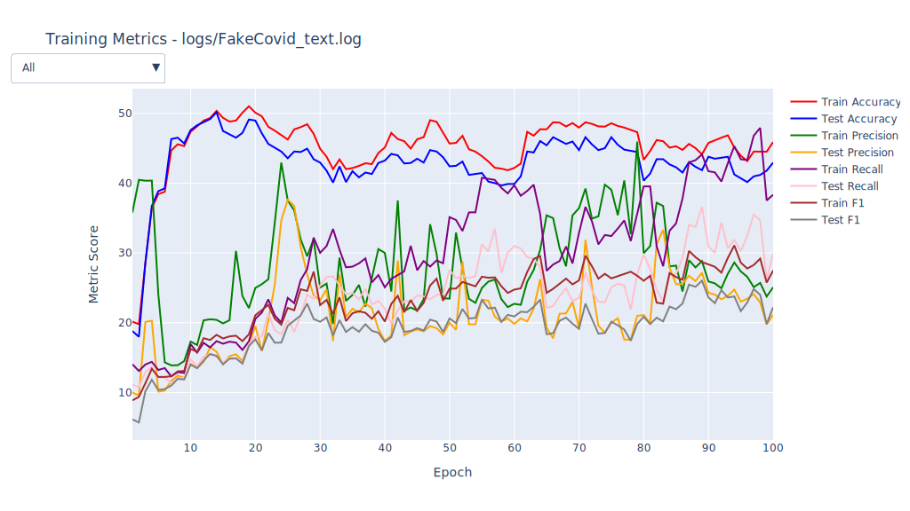

# Plots
## FakeCovid_domain.svg

| Metric | Epoch 1 | Epoch 100 | &#8710;% last | Max | &#8710;% max | Std Dev |
| - | - | - | - | - | - | - |
| Train Accuracy | 33.06 | 35.39 | 07.05 | 51.44 | 55.60 | 03.59 |
| Test Accuracy | 35.43 | 33.04 | -6.75 | 48.43 | 36.69 | 03.19 |
| Train Precision | 19.93 | 20.03 | 00.50 | 27.64 | 38.69 | 01.78 |
| Test Precision | 17.75 | 17.75 | 00.00 | 28.08 | 58.20 | 02.32 |
| Train Recall | 19.30 | 41.32 | 114.09 | 51.11 | 164.82 | 05.84 |
| Test Recall | 17.70 | 32.31 | 82.54 | 42.53 | 140.28 | 04.93 |
| Train F1 | 17.14 | 20.15 | 17.56 | 29.09 | 69.72 | 02.40 |
| Test F1 | 15.22 | 17.50 | 14.98 | 25.40 | 66.89 | 02.10 |
## FakeCovid_text.svg

| Metric | Epoch 1 | Epoch 100 | &#8710;% last | Max | &#8710;% max | Std Dev |
| - | - | - | - | - | - | - |
| Train Accuracy | 44.13 | 37.71 | -14.55 | 51.37 | 16.41 | 03.00 |
| Test Accuracy | 46.58 | 35.77 | -23.21 | 52.26 | 12.19 | 03.39 |
| Train Precision | 29.43 | 28.37 | -3.60 | 41.48 | 40.94 | 03.88 |
| Test Precision | 09.80 | 23.58 | 140.61 | 32.34 | 230.00 | 03.84 |
| Train Recall | 11.14 | 38.59 | 246.41 | 48.73 | 337.43 | 10.06 |
| Test Recall | 10.81 | 31.94 | 195.47 | 36.43 | 237.00 | 06.41 |
| Train F1 | 10.49 | 24.94 | 137.75 | 32.67 | 211.44 | 05.29 |
| Test F1 | 09.75 | 20.82 | 113.54 | 24.93 | 155.69 | 03.56 |
## FakeCovid_text_domain.svg

| Metric | Epoch 1 | Epoch 100 | &#8710;% last | Max | &#8710;% max | Std Dev |
| - | - | - | - | - | - | - |
| Train Accuracy | 47.52 | 44.05 | -7.30 | 53.18 | 11.91 | 02.97 |
| Test Accuracy | 45.35 | 39.60 | -12.68 | 49.11 | 08.29 | 02.58 |
| Train Precision | 38.26 | 28.86 | -24.57 | 48.87 | 27.73 | 03.59 |
| Test Precision | 13.32 | 22.23 | 66.89 | 33.96 | 154.95 | 03.81 |
| Train Recall | 16.03 | 45.03 | 180.91 | 58.91 | 267.50 | 10.65 |
| Test Recall | 13.15 | 29.44 | 123.88 | 43.79 | 233.00 | 07.35 |
| Train F1 | 16.55 | 31.44 | 89.97 | 38.03 | 129.79 | 04.92 |
| Test F1 | 12.82 | 22.72 | 77.22 | 29.34 | 128.86 | 03.68 |
## FakeNewsNet-gossipcop_domain.svg

| Metric | Epoch 1 | Epoch 100 | &#8710;% last | Max | &#8710;% max | Std Dev |
| - | - | - | - | - | - | - |
| Train Accuracy | 64.91 | 74.98 | 15.51 | 74.98 | 15.51 | 01.54 |
| Test Accuracy | 63.84 | 73.24 | 14.72 | 73.24 | 14.72 | 01.43 |
| Train Precision | 61.97 | 68.09 | 09.88 | 68.09 | 09.88 | 01.07 |
| Test Precision | 61.62 | 66.55 | 08.00 | 66.69 | 08.23 | 00.86 |
| Train Recall | 66.16 | 71.71 | 08.39 | 71.81 | 08.54 | 01.05 |
| Test Recall | 65.76 | 70.22 | 06.78 | 70.89 | 07.80 | 00.83 |
| Train F1 | 60.92 | 69.13 | 13.48 | 69.13 | 13.48 | 01.34 |
| Test F1 | 60.17 | 67.44 | 12.08 | 67.56 | 12.28 | 01.17 |
## FakeNewsNet-gossipcop_domain_tweet.svg

| Metric | Epoch 1 | Epoch 100 | &#8710;% last | Max | &#8710;% max | Std Dev |
| - | - | - | - | - | - | - |
| Train Accuracy | 62.66 | 75.09 | 19.84 | 76.86 | 22.66 | 01.70 |
| Test Accuracy | 61.99 | 73.24 | 18.15 | 74.91 | 20.84 | 01.59 |
| Train Precision | 61.02 | 67.87 | 11.23 | 69.07 | 13.19 | 01.21 |
| Test Precision | 61.23 | 66.20 | 08.12 | 67.23 | 09.80 | 01.00 |
| Train Recall | 65.02 | 71.05 | 09.27 | 71.44 | 09.87 | 01.07 |
| Test Recall | 65.34 | 69.48 | 06.34 | 70.18 | 07.41 | 00.91 |
| Train F1 | 59.17 | 68.88 | 16.41 | 69.82 | 18.00 | 01.43 |
| Test F1 | 58.91 | 67.08 | 13.87 | 68.13 | 15.65 | 01.27 |
## FakeNewsNet-gossipcop_text.svg

| Metric | Epoch 1 | Epoch 100 | &#8710;% last | Max | &#8710;% max | Std Dev |
| - | - | - | - | - | - | - |
| Train Accuracy | 77.93 | 72.75 | -6.65 | 77.93 | 00.00 | 02.16 |
| Test Accuracy | 77.82 | 71.00 | -8.76 | 77.82 | 00.00 | 02.34 |
| Train Precision | 69.56 | 68.79 | -1.11 | 69.56 | 00.00 | 00.94 |
| Test Precision | 69.57 | 67.46 | -3.03 | 69.57 | 00.00 | 00.95 |
| Train Recall | 68.65 | 74.95 | 09.18 | 75.40 | 09.83 | 01.30 |
| Test Recall | 69.11 | 73.32 | 06.09 | 74.36 | 07.60 | 01.22 |
| Train F1 | 69.07 | 69.02 | -0.07 | 70.23 | 01.68 | 01.72 |
| Test F1 | 69.33 | 67.33 | -2.88 | 69.33 | 00.00 | 01.83 |
## FakeNewsNet-gossipcop_text_domain.svg

| Metric | Epoch 1 | Epoch 100 | &#8710;% last | Max | &#8710;% max | Std Dev |
| - | - | - | - | - | - | - |
| Train Accuracy | 68.09 | 77.45 | 13.75 | 81.31 | 19.42 | 04.81 |
| Test Accuracy | 67.48 | 76.49 | 13.35 | 80.92 | 19.92 | 04.96 |
| Train Precision | 65.40 | 71.73 | 09.68 | 74.40 | 13.76 | 02.38 |
| Test Precision | 64.94 | 71.03 | 09.38 | 73.92 | 13.83 | 02.45 |
| Train Recall | 70.83 | 77.23 | 09.04 | 77.61 | 09.57 | 02.22 |
| Test Recall | 70.20 | 76.65 | 09.19 | 77.56 | 10.48 | 02.42 |
| Train F1 | 64.57 | 73.02 | 13.09 | 74.77 | 15.80 | 03.89 |
| Test F1 | 63.99 | 72.17 | 12.78 | 74.48 | 16.39 | 04.04 |
## FakeNewsNet-gossipcop_text_domain_tweet.svg

| Metric | Epoch 1 | Epoch 100 | &#8710;% last | Max | &#8710;% max | Std Dev |
| - | - | - | - | - | - | - |
| Train Accuracy | 70.63 | 78.61 | 11.30 | 79.49 | 12.54 | 03.25 |
| Test Accuracy | 68.50 | 77.53 | 13.18 | 78.77 | 14.99 | 03.32 |
| Train Precision | 66.13 | 72.55 | 09.71 | 73.03 | 10.43 | 01.52 |
| Test Precision | 64.59 | 71.68 | 10.98 | 72.39 | 12.08 | 01.53 |
| Train Recall | 71.23 | 77.63 | 08.98 | 77.90 | 09.36 | 01.78 |
| Test Recall | 69.40 | 76.91 | 10.82 | 77.06 | 11.04 | 01.85 |
| Train F1 | 66.30 | 73.97 | 11.57 | 74.49 | 12.35 | 02.80 |
| Test F1 | 64.32 | 72.98 | 13.46 | 73.78 | 14.71 | 02.87 |
## FakeNewsNet-gossipcop_text_tweet.svg

| Metric | Epoch 1 | Epoch 100 | &#8710;% last | Max | &#8710;% max | Std Dev |
| - | - | - | - | - | - | - |
| Train Accuracy | 67.97 | 75.30 | 10.78 | 80.01 | 17.71 | 01.69 |
| Test Accuracy | 67.05 | 74.01 | 10.38 | 79.86 | 19.11 | 01.99 |
| Train Precision | 63.67 | 69.53 | 09.20 | 72.52 | 13.90 | 01.17 |
| Test Precision | 63.05 | 68.22 | 08.20 | 72.35 | 14.75 | 01.33 |
| Train Recall | 68.08 | 74.61 | 09.59 | 74.97 | 10.12 | 01.37 |
| Test Recall | 67.32 | 72.99 | 08.42 | 73.67 | 09.43 | 01.05 |
| Train F1 | 63.46 | 70.57 | 11.20 | 72.25 | 13.85 | 01.13 |
| Test F1 | 62.64 | 69.12 | 10.34 | 71.57 | 14.26 | 01.28 |
## FakeNewsNet-gossipcop_tweet.svg

| Metric | Epoch 1 | Epoch 100 | &#8710;% last | Max | &#8710;% max | Std Dev |
| - | - | - | - | - | - | - |
| Train Accuracy | 24.03 | 24.03 | 00.00 | 24.03 | 00.00 | 00.01 |
| Test Accuracy | 24.10 | 24.10 | 00.00 | 24.10 | 00.00 | 00.03 |
| Train Precision | 12.01 | 12.01 | 00.00 | 12.01 | 00.00 | 00.00 |
| Test Precision | 12.05 | 12.05 | 00.00 | 12.05 | 00.00 | 00.01 |
| Train Recall | 50.00 | 50.00 | 00.00 | 50.00 | 00.00 | 00.03 |
| Test Recall | 50.00 | 50.00 | 00.00 | 50.00 | 00.00 | 00.06 |
| Train F1 | 19.37 | 19.37 | 00.00 | 19.37 | 00.00 | 00.01 |
| Test F1 | 19.42 | 19.42 | 00.00 | 19.42 | 00.00 | 00.02 |
## FakeNewsNet-politifact_domain.svg

| Metric | Epoch 1 | Epoch 100 | &#8710;% last | Max | &#8710;% max | Std Dev |
| - | - | - | - | - | - | - |
| Train Accuracy | 56.52 | 83.29 | 47.36 | 84.00 | 48.62 | 04.49 |
| Test Accuracy | 47.64 | 76.89 | 61.40 | 76.89 | 61.40 | 04.62 |
| Train Precision | 72.66 | 83.07 | 14.33 | 83.84 | 15.39 | 02.84 |
| Test Precision | 68.59 | 76.13 | 10.99 | 84.90 | 23.78 | 02.82 |
| Train Recall | 62.36 | 82.44 | 32.20 | 83.13 | 33.31 | 04.48 |
| Test Recall | 58.31 | 77.97 | 33.72 | 77.97 | 33.72 | 04.87 |
| Train F1 | 53.32 | 82.70 | 55.10 | 83.42 | 56.45 | 05.31 |
| Test F1 | 44.15 | 76.24 | 72.68 | 76.24 | 72.68 | 06.01 |
## FakeNewsNet-politifact_domain_tweet.svg

| Metric | Epoch 1 | Epoch 100 | &#8710;% last | Max | &#8710;% max | Std Dev |
| - | - | - | - | - | - | - |
| Train Accuracy | 58.06 | 77.73 | 33.88 | 78.44 | 35.10 | 04.32 |
| Test Accuracy | 63.21 | 68.87 | 08.95 | 75.00 | 18.65 | 02.39 |
| Train Precision | 29.03 | 80.06 | 175.78 | 80.46 | 177.16 | 09.65 |
| Test Precision | 31.60 | 75.75 | 139.72 | 84.01 | 165.85 | 08.60 |
| Train Recall | 50.00 | 79.91 | 59.82 | 80.36 | 60.72 | 06.67 |
| Test Recall | 50.00 | 74.84 | 49.68 | 76.47 | 52.94 | 05.61 |
| Train F1 | 36.73 | 77.72 | 111.60 | 78.20 | 112.90 | 08.99 |
| Test F1 | 38.73 | 68.84 | 77.74 | 74.45 | 92.23 | 06.76 |
## FakeNewsNet-politifact_text.svg

| Metric | Epoch 1 | Epoch 100 | &#8710;% last | Max | &#8710;% max | Std Dev |
| - | - | - | - | - | - | - |
| Train Accuracy | 55.69 | 71.21 | 27.87 | 83.18 | 49.36 | 03.78 |
| Test Accuracy | 48.58 | 59.43 | 22.33 | 75.00 | 54.38 | 04.93 |
| Train Precision | 66.32 | 75.28 | 13.51 | 83.03 | 25.20 | 02.55 |
| Test Precision | 58.60 | 64.77 | 10.53 | 74.29 | 26.77 | 03.27 |
| Train Recall | 60.78 | 74.03 | 21.80 | 83.90 | 38.04 | 03.41 |
| Test Recall | 56.38 | 64.43 | 14.28 | 76.10 | 34.98 | 03.98 |
| Train F1 | 53.48 | 71.12 | 32.98 | 83.04 | 55.27 | 03.97 |
| Test F1 | 47.46 | 59.42 | 25.20 | 74.30 | 56.55 | 04.84 |
## FakeNewsNet-politifact_text_domain.svg

| Metric | Epoch 1 | Epoch 100 | &#8710;% last | Max | &#8710;% max | Std Dev |
| - | - | - | - | - | - | - |
| Train Accuracy | 43.72 | 84.72 | 93.78 | 86.73 | 98.38 | 07.02 |
| Test Accuracy | 37.74 | 73.11 | 93.72 | 76.42 | 102.49 | 06.79 |
| Train Precision | 71.35 | 84.50 | 18.43 | 86.32 | 20.98 | 03.60 |
| Test Precision | 68.57 | 71.98 | 04.97 | 75.40 | 09.96 | 02.56 |
| Train Recall | 51.53 | 85.39 | 65.71 | 87.27 | 69.36 | 05.81 |
| Test Recall | 50.75 | 73.37 | 44.57 | 77.06 | 51.84 | 04.36 |
| Train F1 | 32.89 | 84.57 | 157.13 | 86.53 | 163.09 | 07.87 |
| Test F1 | 28.55 | 72.17 | 152.78 | 75.63 | 164.90 | 07.35 |
## FakeNewsNet-politifact_text_domain_tweet.svg

| Metric | Epoch 1 | Epoch 100 | &#8710;% last | Max | &#8710;% max | Std Dev |
| - | - | - | - | - | - | - |
| Train Accuracy | 66.47 | 83.06 | 24.96 | 86.73 | 30.48 | 03.64 |
| Test Accuracy | 67.45 | 75.00 | 11.19 | 78.77 | 16.78 | 03.56 |
| Train Precision | 75.59 | 83.24 | 10.12 | 86.31 | 14.18 | 02.51 |
| Test Precision | 69.22 | 74.23 | 07.24 | 77.57 | 12.06 | 02.40 |
| Train Recall | 60.50 | 84.11 | 39.02 | 87.00 | 43.80 | 04.39 |
| Test Recall | 57.38 | 75.94 | 32.35 | 79.19 | 38.01 | 04.04 |
| Train F1 | 57.07 | 82.97 | 45.38 | 86.53 | 51.62 | 04.48 |
| Test F1 | 54.54 | 74.30 | 36.23 | 77.95 | 42.92 | 04.31 |
## FakeNewsNet-politifact_text_tweet.svg

| Metric | Epoch 1 | Epoch 100 | &#8710;% last | Max | &#8710;% max | Std Dev |
| - | - | - | - | - | - | - |
| Train Accuracy | 51.18 | 78.55 | 53.48 | 81.87 | 59.96 | 06.62 |
| Test Accuracy | 40.57 | 70.75 | 74.39 | 77.36 | 90.68 | 08.06 |
| Train Precision | 65.12 | 80.04 | 22.91 | 81.93 | 25.81 | 03.70 |
| Test Precision | 50.62 | 71.01 | 40.28 | 76.35 | 50.83 | 04.68 |
| Train Recall | 57.25 | 80.35 | 40.35 | 82.78 | 44.59 | 05.50 |
| Test Recall | 50.31 | 72.58 | 44.27 | 78.07 | 55.18 | 05.84 |
| Train F1 | 46.89 | 78.55 | 67.52 | 81.76 | 74.37 | 07.14 |
| Test F1 | 37.07 | 70.31 | 89.67 | 76.61 | 106.66 | 08.29 |
## FakeNewsNet-politifact_tweet.svg

| Metric | Epoch 1 | Epoch 100 | &#8710;% last | Max | &#8710;% max | Std Dev |
| - | - | - | - | - | - | - |
| Train Accuracy | 58.06 | 44.91 | -22.65 | 58.06 | 00.00 | 01.36 |
| Test Accuracy | 63.21 | 38.68 | -38.81 | 63.21 | 00.00 | 02.48 |
| Train Precision | 54.04 | 71.61 | 32.51 | 71.61 | 32.51 | 02.02 |
| Test Precision | 31.60 | 68.75 | 117.56 | 68.75 | 117.56 | 03.70 |
| Train Recall | 50.04 | 52.55 | 05.02 | 52.55 | 05.02 | 00.27 |
| Test Recall | 50.00 | 51.49 | 02.98 | 51.49 | 02.98 | 00.32 |
| Train F1 | 36.99 | 35.03 | -5.30 | 36.99 | 00.00 | 00.41 |
| Test F1 | 38.73 | 30.17 | -22.10 | 38.73 | 00.00 | 01.07 |
## FakeNewsNet_domain.svg

| Metric | Epoch 1 | Epoch 100 | &#8710;% last | Max | &#8710;% max | Std Dev |
| - | - | - | - | - | - | - |
| Train Accuracy | 62.20 | 74.71 | 20.11 | 74.71 | 20.11 | 01.83 |
| Test Accuracy | 61.23 | 73.49 | 20.02 | 73.49 | 20.02 | 01.72 |
| Train Precision | 61.18 | 68.30 | 11.64 | 68.30 | 11.64 | 01.20 |
| Test Precision | 60.91 | 67.25 | 10.41 | 67.28 | 10.46 | 00.99 |
| Train Recall | 64.96 | 71.72 | 10.41 | 71.88 | 10.65 | 01.13 |
| Test Recall | 64.65 | 70.87 | 09.62 | 71.43 | 10.49 | 00.97 |
| Train F1 | 59.17 | 69.28 | 17.09 | 69.28 | 17.09 | 01.54 |
| Test F1 | 58.44 | 68.14 | 16.60 | 68.16 | 16.63 | 01.38 |
## FakeNewsNet_text.svg

| Metric | Epoch 1 | Epoch 100 | &#8710;% last | Max | &#8710;% max | Std Dev |
| - | - | - | - | - | - | - |
| Train Accuracy | 65.39 | 72.53 | 10.92 | 74.93 | 14.59 | 01.49 |
| Test Accuracy | 64.53 | 71.92 | 11.45 | 74.29 | 15.12 | 01.63 |
| Train Precision | 63.08 | 68.82 | 09.10 | 69.10 | 09.54 | 00.98 |
| Test Precision | 62.24 | 68.37 | 09.85 | 68.61 | 10.23 | 01.07 |
| Train Recall | 67.36 | 74.49 | 10.58 | 74.49 | 10.58 | 01.27 |
| Test Recall | 66.29 | 74.03 | 11.68 | 74.03 | 11.68 | 01.34 |
| Train F1 | 61.97 | 69.03 | 11.39 | 70.10 | 13.12 | 01.25 |
| Test F1 | 61.02 | 68.44 | 12.16 | 69.47 | 13.85 | 01.39 |
## FakeNewsNet_text_domain.svg

| Metric | Epoch 1 | Epoch 100 | &#8710;% last | Max | &#8710;% max | Std Dev |
| - | - | - | - | - | - | - |
| Train Accuracy | 71.80 | 76.61 | 06.70 | 78.70 | 09.61 | 01.03 |
| Test Accuracy | 71.79 | 75.97 | 05.82 | 78.25 | 09.00 | 01.07 |
| Train Precision | 66.45 | 71.19 | 07.13 | 72.76 | 09.50 | 00.92 |
| Test Precision | 66.65 | 70.77 | 06.18 | 72.19 | 08.31 | 00.91 |
| Train Recall | 70.60 | 76.12 | 07.82 | 76.93 | 08.97 | 01.14 |
| Test Recall | 71.05 | 75.97 | 06.92 | 76.67 | 07.91 | 01.07 |
| Train F1 | 67.07 | 72.34 | 07.86 | 74.07 | 10.44 | 01.02 |
| Test F1 | 67.22 | 71.82 | 06.84 | 73.49 | 09.33 | 01.03 |
